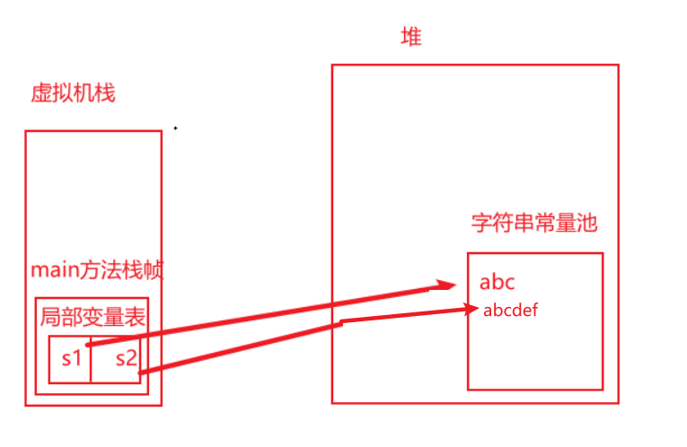
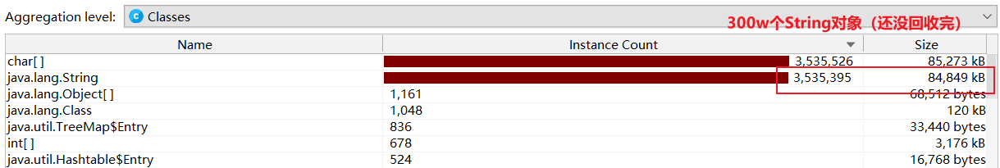

# 10.再看String

这样说一下：局部变量表一个Slot槽能放一个byte, short, char, boolean, float，int类型的变量。两个Slot槽能放一个double，long类型的数据。所以向byte，short，char真的只占1字节，2字节，2字节吗？

## 1.String的基本特性

1. String声明为final的，不可被继承，且实现了Seriablizable（支持在进程间通过序列化传递）接口和Comparable接口。String的两种实例化方式

   字面量定义方式：String s1 = "abc";

   对象定义方式：String s2 = new ("abc");

2. String在jdk8及其以前内部定义为final char[] value用于存储字符串数据，jdk9时改为了byte[]。[官网介绍](http://openjdk.java.net/jeps/254)。

   

   

   - 动机：String类的当前实现是将字符存储在char数组中，一个字符2字节。从许多不同的应用程序收集的数据表明，字符串是堆使用的主要组成部分，而且大多数String对象仅包含Latin-1字符。此类字符仅需要一个字节的存储空间，因此String对象内部的char数组中有一半空间未使用。

   - 描述：我们建议将String的内部实现从UTF-16（char[]，2个字节表示一个字符）更改为字节数组（byte[]，一个字节表示一个字符）再加上编码标志位（为了兼容类似汉字这样多字节表示的字符）。新的String类存储基于ISO-8859-1/Latin-1字符集编码的字符或者基于UTF-16编码的字符，编码标志位指示具体使用哪种字符集进行编码。

     与字符串相关的类（如 AbstractStringBuilder、StringBuilder 和 StringBuffer）将更新为使用相同的表示形式，HotSpot VM 的内在字符串操作也是如此。

3. String字符串的不可变性：代表不可变的字符序列，也可以从这方面理解，数组一开始就固定了容量长度，扩容的话只能新建一个数组再进行复制操作。

   - 通过字面量的方式创建一个字符串，此时得到字符串值声明在字符串常量池中。字符串常量池是不允许有相同字符串的。

     ```java
     public class StringTest {
         public static void main(String[] args) {
             String s1 = "abc";
             String s2 = "abc";
             System.out.println(s1 == s2); //比较的是引用（地址值）
         }
     }
     ```

     

     

   - 当对字符串重新赋值时，需要重写指定内存区域赋值，不能使用原有的value进行赋值。

   - 当对现有的字符串进行拼接操作时，也需要重新指定内存区域赋值，不能使用原有的value进行赋值。

     ```java
     String s1 = "abc";
     String s2 = "abc";
     s2 += "def";
     System.out.println(s1 == s2);
     ```

     

   - 当调用String的replace()方法修改指定字符或字符串时，也需要重新指定内存区域赋值，不能使用原有的value进行赋值。

     ```java
     String s1 = "abc";
     String s2 = s1.replace('a', 'm');
     ```

     

4. 字符串常量池中不会存储相同内容的字符串

   String的String Pool（字符串常量池）是一个固定大小的Hashtable，所以也可以称为StringTable，在JDK6中的默认值大小长度是1009，JDK7之后的默认长度是60013。Hashtable对象的默认长度是11。

   使用-XX:StringTableSize可设置StringTable的长度，在JDK8中StringTable长度的最小值是1009。

   如果String Pool中的String非常多，而且底层Hashtable的长度又较小时，就会产生较多的Hash冲突，导致桶上的链表变长（hash值相同的都放在一个链表上），而链表长了以后，就会导致查询的效率降低。比如String.intern()方法，它会判断调用者在String Pool中是否已经存在，如果不存在的话会在String Pool将其创建。链表过长会导致这个判断的过程效率下降。如果Hashtable较长的话，根据key计算hash时（key % length），计算的就会很分散，大大减少发生hash冲突的频率，那么在进行String.intern判断时，直接通过key就找到对应的value，且不用再遍历链表（或者遍历的链表长度很短），效率就会高很多。

   ```java
   public class StringTest1 {
       public static void main(String[] args) {
           BufferedReader br = null;
           try {
               br = new BufferedReader(new FileReader("words.txt"));
               long start = System.currentTimeMillis();
               String data;
               while ((data = br.readLine()) != null) {
                   data.intern(); //判断字符串常量池中有没有对应的data的字符串，没有的话在常量池中生成。
               }
               long end = System.currentTimeMillis();
               /**
                * -XX:StringTableSize=1009  StringTable长度是1009时，花费103ms
                * -XX:StringTableSize=60003 StringTable长度是60003时，花费30ms
                */
               System.out.println("花费时间位："+(end - start));
           } catch (IOException e) {
               e.printStackTrace();
           } finally {
               try {
                   br.close();
               } catch (IOException e) {
                   e.printStackTrace();
               }
           }
       }
   }
   ```


## 2.String的内存分配（浮于表面）

在Java语言中有8种基本数据类型和一种比较特殊的类型String，为了使这些类型的数据在运行过程中更快，更节省内存，都提供了一种常量池的概念。

常量池就类似一个Java系统级别提供的缓存，8种基本数据类型的常量池都是系统协调的，所以我们不对其进行太多考虑。String类型的常量池比较特殊，它的主要使用方法有两种：

- 直接使用双引号声明出来的String对象会直接存储在常量池种：String info = "atguigu.com";
- 如果不适用双引号声明的String对象，可以使用String提供的intern()方法。

Java6及以前，字符串常量池存放在永久代，Java7中oracle的工程师对字符串池的逻辑做了很大的改变，将字符串常量池的位置调整到Java堆中，所有的字符串都保存在堆中。**和其他普通对象一样**，这样可以让你在进行调优应用时主要针对堆进行调整即可。

- 在JDK6时，方法区的实现还叫作永久代，而且是从JVM运行时数据区分配的空间，其默认大小本来就不大，而且还要放很多的class信息。
- 永久代的回收频率很低，虚拟机规范也没有要求虚拟机对方法区必须进行回收。所以其中不再使用的字符串，做不到及时回收，再加上永久代比较小，所以容易出现OOM。

## 3.字符串拼接操作

创建字符串常量时，首先判断字符串常量池是否存在该字符串，存在该字符串，返回引用实例，不存在，实例化该字符串并放入池中。

1. 先说几个结论：
   1. 常量与常量的拼接结果在常量池，原理是编译期优化
   2. 常量池中不会存在相同内容的常量
   3. 拼接操作时只要其中有一个是变量，结果就在堆（常量池之外的堆中，类似创建一个对象）中，变量拼接的原理是StringBuilder。
   4. 如果拼接的结果调用intern()方法，则主动将常量池中还没有的字符串对象放入池中，（有的话，返回已有的对象地址）并返回对象地址。

2. 常量与常量的拼接结果在常量池，原理是编译期优化：

   ```java
   @Test
   public void test1(){
       String s1 = "a" + "b" + "c";//编译期优化：等同于"abc"
       String s2 = "abc"; //"abc"一定是放在字符串常量池中，将此地址赋给s2
       /*
            * 最终.java编译成.class,再执行.class
            * String s1 = "abc";
            * String s2 = "abc"
            */
       System.out.println(s1 == s2); //true
       System.out.println(s1.equals(s2)); //比较的是常量值，肯定是true
   }
   ```

   javac在进行编译时，会将String s1 = "a" + "b" + "c";这种拼接操作，直接等同于String s1 = "abc"; 最终的结果就是在常量池中初始化了一个"abc"，并将该字符串的地址赋值给s1。

3. 拼接操作只要有一个变量，拼接的原理是StringBuilder，最后就相当于new String("")，结果放到堆中，类似创建一个对象

   ```java
       @Test
       public void test3(){
           String s1 = "a";
           String s2 = "b";
           String s3 = "ab";
           /*
           如下的s1 + s2 底层的执行细节：(变量s是我临时定义的）
           ① StringBuilder s = new StringBuilder();
           ② s.append("a")
           ③ s.append("b")
           ④ s.toString()  --> 约等于 new String("ab")
   
           补充：在jdk5.0之后使用的是StringBuilder,在jdk5.0之前使用的是StringBuffer
            */
           String s4 = s1 + s2;//
           System.out.println(s3 == s4);//false
       }
   ```

   ```java
   @Test
   public void test2(){
       String s1 = "javaEE";
       String s2 = "hadoop";
   
       String s3 = "javaEEhadoop";
       String s4 = "javaEE" + "hadoop";//编译期优化
       //如果拼接符号的前后出现了变量，则相当于在堆空间中new String()，具体的内容为拼接的结果：javaEEhadoop
       //所以s5 s6 s7相当于分别new了3个新的对象，在常量池外的堆空间中开辟了3个空间，指向3个不同的对象，是3个不同的引用变量
       String s5 = s1 + "hadoop";
       String s6 = "javaEE" + s2;
       String s7 = s1 + s2;
   
       System.out.println(s3 == s4);//true
       System.out.println(s3 == s5);//false
       System.out.println(s3 == s6);//false
       System.out.println(s3 == s7);//false
       System.out.println(s5 == s6);//false
       System.out.println(s5 == s7);//false
       System.out.println(s6 == s7);//false
       //intern():判断字符串常量池中是否存在javaEEhadoop值，如果存在，则返回常量池中javaEEhadoop的地址；
       //如果字符串常量池中不存在javaEEhadoop，则在常量池中加载一份javaEEhadoop，并返回次对象的地址。
       String s8 = s6.intern();
       System.out.println(s3 == s8);//true
   }
   ```

   我们单独看一下s3和s5：s3的字面量是”javaEEhadoop“，s5的字面量也是”javaEEhadoop“。但是s3这个引用指向的是字符串常量池中的”javaEEhadoop“，s5是指向的堆中的一个String对象。

4. 拼接的两边是常量的话，底层还是会被编译器优化成字符量初始化字符串，结果放在字符串常量池。

   被final 修饰的变量本质上其实是常量：如果是用final修饰的static变量，会在编译阶段就初始化具体值：final修饰得static是一个常量不是变量，在类编译的时候就分配具体的值了。

   ```java
   /*
       1. 字符串拼接操作不一定使用的是StringBuilder!
          如果拼接符号左右两边都是字符串常量或常量引用，则仍然使用编译期优化，即非StringBuilder的方式。
       2. 针对于final修饰类、方法、基本数据类型、引用数据类型的量的结构时，能使用上final的时候建议使用上。
        */
   @Test
   public void test4(){
       final String s1 = "a";
       final String s2 = "b";
       String s3 = "ab";
       String s4 = s1 + s2;
       System.out.println(s3 == s4);//true
   }
   
   //练习：
   @Test
   public void test5(){
       String s1 = "javaEEhadoop";
       String s2 = "javaEE";
       String s3 = s2 + "hadoop";
       System.out.println(s1 == s3);//false
   
       final String s4 = "javaEE";//s4:常量
       String s5 = s4 + "hadoop";
       System.out.println(s1 == s5);//true
   
   }
   ```

5. 拼接操作和append操作的效率对比

    体会执行效率：每次循环都会创建一个StringBuilder、tringBuilder.toString()又会创建一个String对象，所以通过StringBuilder的append()的方式添加字符串的效率要远高于使用String的字符串拼接方式！
    
    - ① StringBuilder的append()的方式：自始至终中只创建过一个StringBuilder的对象，使用String的字符串拼接方式：创建过多个StringBuilder和String的对象。
    
    - ② 使用String的字符串拼接方式：内存中由于创建了较多的StringBuilder和String的对象，内存占用更大；如果进行GC，需要花费额外的时间。
    
   - 改进的空间：在实际开发中，如果基本确定要前前后后添加的字符串长度不高于某个限定值capacity的情况下,建议使用构造器实例化：StringBuilder s = new StringBuilder(capacity); // new char[capacity] ，尽量避免对char[]进行扩容，复制的操作。
   
     
   
   - StringBuffer是同步的，效率更差一些。
   
   ```java
       @Test
       public void test6(){
   
           long start = System.currentTimeMillis();
   
           method1(100000);//3118ms
           //method2(100000);//3ms
   
           long end = System.currentTimeMillis();
   
           System.out.println("花费的时间为：" + (end - start));
       }
   
       public void method1(int highLevel){
           String src = "";
           for(int i = 0;i < highLevel;i++){
               src = src + "a";//每次循环都会创建一个StringBuilder、tringBuilder.toString()又会创建一个String对象
           }
           //System.out.println(src);
   
       }
   
       public void method2(int highLevel){
           //只需要创建一个StringBuilder
           StringBuilder src = new StringBuilder();
        for (int i = 0; i < highLevel; i++) {
               src.append("a");
           }
           //System.out.println(src);
       }
   ```
   
6. StringBuilder的进一步改进：

   如果可以的话，尽量使用StringBuilder带参数的构造器，指定char[]数组的大小：`value = new char[capacity];`。

   因为使用默认构造器的话，初始的char[]数组的大小是16。如果在进行大量拼接操作时，会导致频繁的进行数组扩容，而数组的长度是不可变的，每次扩容操作都是开辟一个新的数组，然后进行数组间的copy，中间也会产生很多垃圾对象，耗时耗力。

## 4.interan()方法


1. interan()是一个本地native方法，其核心逻辑就是当intern()被调用时，会判断字符串常量池中是否存在与该String对象相同的字符串，判断的方法是equal方法。如果有的话就返回字符串常量池中字符串对象的引用，如果没有JDK8会将该字符串对象的**引用**加到字符串常量池并返回其引用（避免在堆中再创建一个String对象）。

2. 注意intern()的返回一定是字符串常量池中的引用：

   ```java
   public void test7() {
       String s1 = "qwer";
       String s2 = new String("qwer");
       String s3 = new String("qwer").intern();
       System.out.println(s1.hashCode());
       System.out.println(s2.hashCode());
       System.out.println(s1 == s2);
   
       s2.intern();
       String s4 = s2.intern();
       System.out.println(s2.hashCode());
       System.out.println(s1 == s2);//false
       System.out.println(s1 == s3);//true
       System.out.println(s1 == s4);//true
   }
   ```

   s1指向的是字符串常量池中的String对象"abc"

   s2指向的是堆中的String对象"abc"

   **s2.intern()返回的结果s4，指向字符串常量池中的String对象"abc"。注意s2指向的还是堆中的String对象"abc"**

3. String的intern()方法的小结：

   当intern()被调用时，会判断字符串常量池中是否存在与该String对象相同的字符串，判断的方法是equal方法。如果有的话就返回字符串常量池中字符串对象的引用，如果字符串常量池中没有该String对象：

   - JDK6会把此对象复制一份，生成一个新的String对象放入字符串常量池，并返回字符串常量池中该对象的引用
   - JDK7之后，则会已有的字符串对象的引用地址复制一份，放入字符串常量池，并返回该引用地址。

   **注意：**什么时候会出现字符串常量池中没有该字符串，但是堆中有这个字符串呢？StringBuilder的toString()方法，它虽然返回了return new String(value, 0, count);但是没有在字符串常量池中创建字符串对象。所以需要在调用以下intern()方法，将这个字符串加到常量池中。


## 5.几个题目

1. String test = "test";到底做了什么？

   字节码文件中有一块区域叫做Constant pool常量池的数据结构，它会存放编译期生成的各种字面量和符号引用，而且在字节码文件被加载到JVM中时，常量池也会被加载进而成了运行时常量池。

   

   

   ```java
   public class Test {  
       public static void main(String[] args) {  
           String test = "test";  
       }  
   }  
   ```

   很简单的一段代码，其main方法对应的字节码指令为：

   

   - 分析一下ldc #2：字节码文件中的常量池会存放编译期生成的"test"字符串（字面量），放在#2索引index处，当Test类加载到虚拟机时，"test"字符串在Constant pool中使用符号引用symbol表示。当第一次调用ldc #2指令时，会尝试从运行时常量池中获取"test"字符串，运行时常量池中索引#2处的symbol还未解析，则会调用C++底层的StringTable::intern()方法生成char数组，并将引用（**注意是char数组的引用**）保存在StringTable和常量池中，当下次再调用ldc #2时，可以直接从运行时常量池中根据索引#2获取"test"字符串的引用，避免再次到StringTable中查找。
   - astore_1：该字节码指令将"test"字符串的引用保存在局部变量表中。

2. new String("abc") 都做了什么？

   - 在堆中创建一个"abc"字符串对象
   - 判断字符串常量池中有没有"abc"字符串，没有的话也创建一个"abc"字符串对象
   - 注意：最后的结果得到两个对象，且**两个字符串对象"abc"是不同的。**
    ```java
    public class StringTest5 {
        public static void main(String[] args) {
            String s1 = new String("abc");
        }
    }
    ```


其中1 - 4行指令对应代码String s1 = new String("abc");

- new指令：在Java堆上为String对象申请内存
- ldc指令：尝试从常量池中获取"Java"字符串，如果常量池中不存在，则在常量池中新建"java"对应的char数组，并压入操作数栈
- invokespecial：调用构造方法，将操作数栈中的char数组传给String的构造方法，初始化String对象。

在JDK8时，String对象使用char数组存储字符串，变量a指向常量池的"java"对象，变量c指向Java堆中的String对象，堆中的String对象中的char数组（引用）指向常量池中的"java"字符串，所以显然 a != c，但是a.value和c.value都指向同一个字符串常量池中的字符串。


3. 题目：

   ```java
   public class StringTest5 {
       public static void main(String[] args) {
           String s1 = new String("abc");
           s1.intern();
           String s2 = "abc";
           System.out.println(s1 == s2);//false
   
           String s4 = "xyz";
           String s3 = new String("xyz");
           System.out.println(s1 == s2);//false
       }
   }
   ```

   s1.intern();时，发现字符串常量池中已经有了"abc"字符串，所以相当于没有做什么操作，不影响结果。

4. String str1 = new String("a") + new String("b");

   对象1：new StringBuilder()
   对象2：new String("a")
   对象3：常量池中的"a"
   对象4：new String("b")
   对象5：常量池中的"b"
   对象6：StringBuilder.toString()返回的new String("ab", 0, count)
   注意：**StringBuilder.toString()不会在字符串中创建对象（不会调用ldc #index字节码指令）**

   3.1.案例1：false

   ```java
   String str1 = new String("a") + new String("b");
   String str2 = "ab";
   System.out.println(str1 == str2);
   ```

   此时结果是false：因为StringBuilder.toString()不会在字符串中创建对象（不会调用ldc #index字节码指令），所以str1指向堆中的对象，str2指向字符串常量池中的对象。

   3.2.案例2：true

   ```java
   String str1 = new String("a") + new String("b");
   //虽然StringBuilder.toString()没有向字符串常量池中创建"ab"对象，但是调用了intern方法后，发现字符串常量池中没有"ab"
   //会把"ab"字符串对象的引用放进字符串常量池，并返回该引用
   str1.intern();
   //发现字符串常量池有了指向"ab"对象的引用，直接将其引用返回给str2
   String str2 = "ab";
   //所以str1和str2都指向堆中的String对象
   System.out.println(str1 == str2);
   ```

   虽然StringBuilder.toString()没有向字符串常量池中创建"ab"对象，但是调用了intern方法后，发现字符串常量池中没有"ab"，**会把"ab"字符串对象的引用放进字符串常量池，并返回该引用。**然后创建str2时，发现字符串常量池中有了指向"ab"字符串对现象的引用，直接将该引用返回给str2。

5. 分析一下str1.intern()：

   执行完String str1 = new String("a") + new String("b");这行代码后，字符串常量池还没有"ab"字符串对象。然后开始执行str1.intern()代码。

   在JDK6中，字符串常量池还在方法区中的运行时常量池中，JDK6在执行intern()后，发现字符串常量池没有该字符串对象会创建一个**新的字符串对象"ab"**放到字符串常量池。所以在执行String str2 = "ab";时，str2指向的是字符串常量池中的对象，str1指向的是堆中的字符串对象，所以结果是false。

   在JDK7/8中，字符串常量池已经移到了堆中，再执行intern()时，发现字符串常量池没有该字符串对象，但是堆中有该对象，本着节省空间的想法，会将堆中对象的引用放到字符串常量池，而不会在堆中新创建一个对象。然后执行String str2 = "ab";会把字符串常量池中指向堆中的对象的引用返回给str2，所以str2和str1都指向堆中的字符串对象，结果是true。

6. 改变一下intern()的执行顺序：

   ```java
   String str1 = new String("a") + new String("b");
   String str2 = "ab";
   String str3 = str1.intern();
   System.out.println(str1 == str2);
   System.out.println(str2 == str3);
   ```

   因为执行String str2 = "ab";时，发现字符串常量池中没有"ab"字符串对象，会在字符串常量池中新创建一个"ab"对象。再执行str1.intern()时，发现字符串常量池已经有了"ab"字符串对象，所以将字符串中的"ab"对象的引用返回给str3。所以str1指向的是堆中的"ab"对象，str2指向的是字符串常量池中的"ab"对象，str3指向的是字符串常量池中的"ab"对象。所以str1 != str2，str2 == str3。

7. String的intern()方法的小结：

   当intern()被调用时，会判断字符串常量池中是否存在与该String对象相同的字符串，判断的方法是equal方法。如果有的话就返回字符串常量池中字符串对象的引用，如果字符串常量池中没有该String对象：

   - JDK6会把此对象复制一份，生成一个新的String对象放入字符串常量池，并返回字符串常量池中该对象的引用
   - JDK7之后，则会已有的字符串对象的引用地址复制一份，放入字符串常量池，并返回该引用地址。

   **注意：**什么时候会出现字符串常量池中没有该字符串，但是堆中有这个字符串呢？StringBuilder的toString()方法，它虽然返回了return new String(value, 0, count);但是没有在字符串常量池中创建字符串对象。所以需要在调用以下intern()方法，将这个字符串加到常量池中。

8. 练习1：

   ```java
   String s = new String("a") + new String("b");
   String s2 = s.intern();
   System.out.println(s2 == "ab");
   System.out.println(s == "ab");
   ```

   

   

9. 练习2：

   ```java
   String x = "ab";
   String s = new String("a") + new String("b");
   String s2 = s.intern();
   System.out.println(s2 == x);
   System.out.println(s == x);
   ```

   

## 6.String的内存分配（底层核心）

疑问：new的String对象和其中的char[]数组和String的引用在内存中是怎么分配的？

**建议：为了避免疑惑，不要说在字符串常量池中创建了字符串对象，最好说在StringTable创建了StringTableEntry，Entry中存放了指向String对象的引用。**


String存储数据的细节：

- 在String中实际使用char数组进行存储，java9之后使用byte数组。也就是说数据最终存放在一个数组中，通过String中的这个cahr数组引用指向的是一个typeArrayOopDesc的数组类型普通对象**指针**。大致过程是String对象的引用指向的是一个在堆内存中分配的instanceOopDesc，再由这个InstanceOopDesc中的char[]指向前面所说的typeArrayOopDesc。

- instanceOopDesc/typeArrayOopDesc：普通实例信息/数组实例信息，大致组成：

  

  

JVM对添加String的处理：

- 在底层所说的常量池是一个类型HashTable的StringTable，其中key使用string和其长度进行计算，value是一个HashEntry结构，如果通过key算出hash，再根据hash计算出在StringTable中对应索引位置存在相同的oop数据，则直接返回次oop，否则创建一个HashEntry加入到StringTable中。

- 在java1.6时代，常量池存放在永久代，且StringTable的长度默认固定在1009会容易导致Hash冲突。在之后将常量池移居到堆空间中，其长度可以变得很大，也可以通过jvm参数调节。

- StringTable的大致结构：

  

new String("xxx")与字面量实例化的区别：

- new String("xxx")：假设之前没有"xxx"字符串常量，那么实际上不仅会在堆空间创建一个oop，还会在常量池对应的创建一个HashEntry，且这个HashEntry中value指向的不是同一个instanceOop，具体示例图如下。

  在new创建字符串时将会使用一个LDC(Load Constant)指令，此指令将会把字符串放到常量池。

  

- 直接赋值 String s = "a"：只在常量池对应的创建一个HashEntry

  

一个特例：

- String s = new String(char[] c)

   

  可以发现这种创建方式，直接使用的内存复制方式创建，也就不会在常量池中创建StringTableEntry。

  

几个例子：

```java
String s1 = new String("a");
String s2 = "a";
```

- 两者不相等，两者指向的是不同的instanceOop（String对象），但是其中的char[]引用指向的是同一个数组对象实例arrayOop。

```java
String s1 = new String("a") + new String("b");
String s2 = "ab";
```

- s1的操作底层走的是StringBuilder的append，然后返回StringBuilder的toString，但是StringBuilder的toString走的还是内存复制，不会在常量池中创建StringTableEntry，所以s1和s2不相等。
- 注意：即使在常量池中创建StringTableEntry，s1和s2也不相等，等价于new String()，指向的不是同一个instanceOop。

```java
String s1 = new String("a") + new String("b");
s1.intern();
String s2 = "ab";
```

- 调用intern方法后，常量池中的Entry会指向同一个instanceOop（**也就是Entry中的value部分，即String对象的引用指向了同一块堆内存**），所以是相等的。

  

  
## 7.intern()的空间效率测试

```java
public class InternTest {
    static final int MAX_COUNT = 100 * 10000;
    static final String[] arr = new String[MAX_COUNT];

    public static void main(String[] args) {
        Integer[] data = {1, 2, 3, 4, 5, 6, 7, 8, 9, 10};
        long start = System.currentTimeMillis();
        for (int i = 0; i < MAX_COUNT; i++) {
            arr[i] = new String(String.valueOf(data[i % data.length]));
            //arr[i] = new String(String.valueOf(data[i % data.length])).intern();
        }
        long end = System.currentTimeMillis();
        System.out.println("花费的时间为：" + (end - start));
        try {
            Thread.sleep(1000000);
        } catch (InterruptedException e) {
            e.printStackTrace();
        }
    }
}
```

先大致分析以下上述代码：

- 一个长度是1000W的String[]数组，循环为其中的所有每个元素进行赋值。

- 循环赋值1，2，3，4，5，6，7，8，9，0

- arr[i] = new String(String.valueOf(data[i % data.length])：每个arr[i]都会指向一个堆中new出来的String对象，所以最后会生成1000W个String对象，且都有引用指向。字符串常量池中的1，2，3，4，5，6，7，8，9，0这10个字符串对象没有被使用。

  花费的时间为：3731

  

  

- arr[i] = new String(String.valueOf(data[i % data.length])).intern()：每个arr[i]指向的是字符串常量池中的1，2，3，4，5，6，7，8，9，0这10个字符串对象，也会在堆中new1000W个String对象，但是并没有引用指向它们。所以**这些堆中的无引用指向的对象会被之后的垃圾收集器回收，节省很大的空间。**

  花费的时间为：714

  

结论：

​	对于程序中有大量重复的字符串时，使用intern()可以节省内存空间。比如大的社交网站，需要内存中存储大量的字符串，例如很多人都存储：北京市，海淀区等信息。这时候如果字符串都调用intern()方法，就会明显降低内存的使用。

建议：

​	一般都是直接字面量定义字符串，此时也是返回字符串常量池中字符串对象的引用，不会出现上面在堆中new许多String对象的情况。所以只有在大量使用new String()时，会在堆中大量创建String字符串对象。平常会使用StringBuilder或者String变量进行拼接操作，例如拼接操作String s = s1 + s2;它们也会在堆中创建一个字符串对象。建议最后再调用一下intern方法，来看看字符串常量池中有没有该字符串，**尽量得到指向字符串常量池中String对象的引用，让在堆中创建的String对象称为垃圾（这也是intern的意义）**，在之后被回收。

```java
String str3 = "ab";

/**
  * 虽然new String("a") + "b"会在堆中创建一个String对象，但是我又调用了.intern()
  * 最后得到的时一个指向字符串常量池中的引用，所以str4指向的是字符串常量池中String对象，堆中的String对象就成了垃圾。
  */
String str4 =  (new String("a") + "b").intern();
System.out.println(str4 == str3);//true
```

## 8.StringTable的垃圾回收测试

参数：-XX:+PrintStringTableStatistics，打印字符串常量池的统计信息

```java
//-XX:+PrintStringTableStatistics -XX:+PrintGCDetails
public class StringGCTest {
    public static void main(String[] args) {
//        for (int i = 0; i < 100; i++) {
//            String.valueOf(i).intern();
//        }
    }
}
```


```java
//-XX:+PrintStringTableStatistics -XX:+PrintGCDetails
public class StringGCTest {
    public static void main(String[] args) {
        for (int i = 0; i < 100; i++) {
            String.valueOf(i).intern();
        }
    }
}
```


## 9.G1中的String去重操作

首先明确一点：字符串常量池中的String一定不是重复的，所以去重的对象是new String()出来的，在堆中的对象。具体一点是去重其中的value = char[]数组。

背景：对许多Java应用测试得到以下结果，堆存活数据集合里面String对象占了25%，堆存活数据集合里面重复的String对象有13.5%，String对象的平均长度是45。发现许多大规模的Java应用的瓶颈在于内存，测试表明，在这些类型的应用中，Java堆中存活的数据集合差不多25%是String对象。更进一步这里面差不多一半String对象是重复的，重复的意思是说：sting1.equals(string2)=true。堆上存在重复的String对象必然是一种内存的浪费，这个项目将在G1垃圾收集器中实现自动持续对重复的String对象进行去重，这样能减少内存的浪费。

大致过程：也就是维护了一个hashtable记录所有的String对象中的不重复char[]数组，如果在hashtable有了要引用得到cahr[]，那么就对这个String对象进行去重，调整其char[]的引用，没有的话就将char[]加到hashtable中。


相关参数：


  

  


