# 11.垃圾回收相关算法

垃圾收集不是Java语言首先提出的概念，不是Java语言的伴生产物。早在1960年，第一门开始使用内存动态分配和垃圾收集技术的Lisp语言诞生后，就提出了垃圾收集的概念。

三个经典的问题：

- 哪些内存需要被回收
- 什么时候回收
- 如何回收

垃圾收集机制是Java的招牌能力，极大地提高了开发效率。如今垃圾收集机制几乎称为了现代语言的标配，即使经过如此漫长的发展，Java的垃圾收集机制仍在不断演进中，不同大小的设备，不同特征的应用场景，对垃圾收集提出了新的挑战，这当然也是面试的热点。

## 1.垃圾回收概述

1. 垃圾：

   指的是在运行程序中没有任何指针指向的对象，这个对象就是需要被回收的垃圾。我们知道Java语言中变量分成基本数据类型和引用数据类型，基本数据类型不涉及垃圾收集概念，它是一个标量，而对象是一个聚合量，由若干标量构成。

   如果不及时的对内存中的垃圾进行清理，那么这些垃圾对象所占的内存空间会一直保留到应用程序结束，这些空间无法被其他对象所使用，甚至可能导致内存溢出。

2. 为什么需要GC

   对于高级语言来说，一个基本认知是如果不进行垃圾回收，内存迟早都会被消耗完，因为不断地分配内存空间而不进行回收，就好像不停地生产生活垃圾而从来不打扫一样。

   除了释放没有的对象，垃圾回收也可以清除内存里的记录碎片。碎片整理将所占用的堆内存移动到堆的一段，以便JVM将整理出的内存分配给新的对象。

   随着应用程序所应付的业务越来越庞大，复杂，用户越来越多，没有GC就不能保证应用程序的正常进行。而经常造成STW的GC又跟不上实际的需求，所以才会不断尝试对GC进行优化。

   内存泄漏：比如一个对象，已经不使用了，但是进行回收的时候还没办法回收掉（始终有引用指向）。
   
3. 早期的垃圾回收

   在早期的C/C++时代，垃圾回收基本上是手工进行的。开发人员可以使用new关键字进行内存申请，并使用delete关键字进行内存释放。这种方式可以灵活控制内存释放的时间，但是会给开发人员带来频繁申请和释放内存的管理负担。倘若有一处内存区间由于程序员编码的问题忘记被回收，那么就会产生内存泄漏，垃圾对象永远无法被清除，随着系统运行时间的不断增长，垃圾对象所消耗内存可能持续上升，直到出现内存溢出并造成程序崩溃。

   现在，除了Java意外，C#，Python，Ruby等语言都使用了自动垃圾回收的思想，也是未来发展趋势。可以说，这种自动化的内存分配和垃圾回收的方式已经成为了现代开发语言必备的标准。

4. Java的垃圾回收概述

   自动内存管理（分配和回收），无需开发人员手动参与内存的分配与回收，这样降低内存泄漏和内存溢出的风险。

   自动内存管理机制，将程序员从繁重的内存管理中释放出来，可以更专心的专注于业务开发。

   但是对于Java开发人员而言，自动内存管理就像是一个黑匣子，如果过度依赖于”自动“，那么将会是一场灾难，最严重的就是会弱化Java开发人员在程序出现内存溢出时定位问题和解决问题的能力。

   所以了解JVM自动内存分配和内存回收原理就显得非常重要，只有在真正了解JVM是如何管理内存后，我们才能够在遇见OOM时，快速地根据错误异常日志定位问题和解决问题。

   当需要排查各种内存溢出，内存泄漏问题时，当垃圾收集成为系统达到更高并发量的瓶颈时，我们就必须对这些”自动化“的技术实施必要的监控和调节。

   Java堆是垃圾收集器的工作重点：频繁收集Young区，较少收集Old区，基本不懂方法区。


## 2.垃圾标记阶段算法之引用计数算法

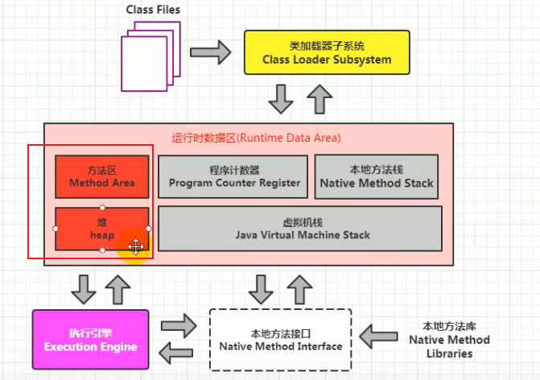

1. 我们先回顾一下：

   JVM运行时数据区涉及到垃圾回收的主要是方法区和堆。本地方法栈和虚拟机栈不涉及垃圾回收但是可能出现内存溢出StackOverFlow。程序计数器及不涉及垃圾回收也不涉及内存溢出。

   JVM规范并没有强制要求方法区进行垃圾回收，所以并不是所有的JVM产品都实现了对方法区的垃圾回收。

   垃圾回收主要针对的是年轻代，较少回收老年代，基本不动方法区。所以垃圾回收主要针对堆，而堆中主要存放的就是对象。

2. 对象存活判断：找出垃圾对象，并打上标记

   在堆里存放着几乎所有的Java实例对象，在GC执行垃圾回收之前，首先需要区分出内存中哪些是存活对象，哪些是已经死亡的对象。只有被标记为已经死亡的对象，GC才会在执行垃圾回收时，释放掉其所占用的内存空间，因此这个过程我们成为垃圾标记节点。
   
   那么在JVM中究竟是如何判断一个死亡对象呢？简单来说就是当一个对象已经不再被任何的存活对象继续引用时，就可以宣判为已经死亡。
   
   判断对象存活的具体算法有两种：引用计数算法和可达性分析算法。
   
3. 引用计数算法：为每个对象保存一个整形的引用计数器属性，用于记录对象被引用的情况。

   对于一个对象A，只要有任何一个对象引用了A，则A的引用计数器就加1；当引用失效时，引用计数器就减1。只要对象A的引用计数器的值为0，就表示对象A不在被使用，可进行回收。

   优点：实现简单，垃圾对象易于辨识（根据引用计数器字段即可辨识），判断效率高，回收没有延迟性（随时可以去判断引用计数器进行垃圾收集）。

   缺点：需要单独的字段存储计数器，增加了存储空间的开销。每次将对象赋值给引用都需要更新计数器，增加了时间开销。其实这两个缺点和它的优点比起来都还好，但它有个致命缺点。

   致命缺点：无法处理循环引用的情况，这是一个致命缺陷，导致在Java垃圾回收器中没有使用这类算法。

4. 循环引用：

   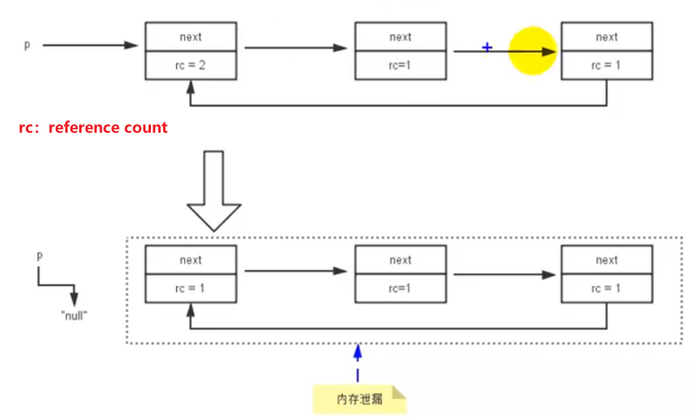

   当p指向null时，对象1，2，3中的引用计数器都还是>0的。所以如果用引用计数算法的话，它们3个不会别标记为垃圾，也不会被回收，但是它们根本不再被使用了，就造成了内存泄漏。

5. 演示一下：Java没有采用引用计数算法，所以可以处理循环引用的垃圾。

   ```java
   //-XX:+PrintGCDetails
   public class RefCountGC {
       //这个成员属性的唯一作用就是占用一点内存
       private byte[] bigSize = new byte[5 * 1024 * 1024];
   
       Object reference = null;
   
       public static void main(String[] args) {
           RefCountGC obj1 = new RefCountGC();
           RefCountGC obj2 = new RefCountGC();
   
           obj1.reference = obj2;
           obj2.reference = obj1;
   
           obj1 = null;
           obj2 = null;
   
           //显示的执行垃圾回收行为
           //System.gc();
       }
   }
   ```

   看一下此时的引用指向情况：两个对象没有栈中的引用指向了，但是它们互相指向，这样能被回收吗？

   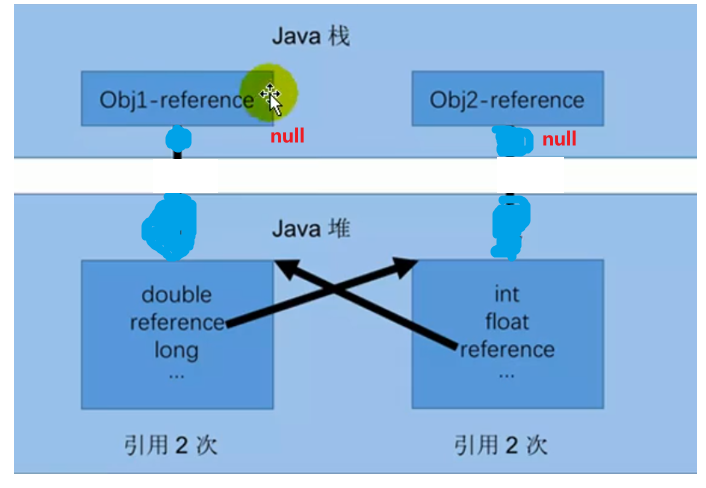

   打开System.gc()前后的变化，说明Java是能够回收循环引用的垃圾，说明Java在垃圾标记阶段没有采用引用计数算法。

   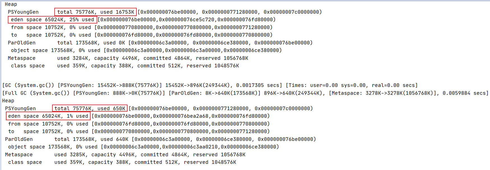

6. Python的引用计数机制

   引用计数算法被很多语言在资源回收机制中采用，比如Python，它同时支持引用计数和垃圾收集机制。具体哪种最优要看场景，业界有大规模视线中仅保留引用计数机制以提高吞吐量的尝试。

   Java并没有选择引用计数，是因为其存在一个基本的难题，即很难处理循环引用的关系。那Python如何解决循环引用呢？

   - 手动解除：在合适的时机，手动解除引用关系。
   - 使用弱引用weakref：weakref是python提供的标准库，旨在解决循环引用。


## 3.垃圾标记阶段算法之可达性分析算法

可达性分析算法也称跟搜索算法或追踪性垃圾收集，它有效的解决了引用计数算法中循环引用的问题，防止内存泄漏的发生。

基本思路就是通过一系列名为”GCRoots”的对象作为起始点，从这个被称为GC Roots的对象开始向下搜索，如果一个对象到GCRoots没有任何引用链相连时，则说明此对象不可用。也即给定一个集合的引用作为根出发，通过引用关系遍历对象图，能被遍历到的（可到达的）对象就被判定为存活，没有被遍历到的就自然被判定为死亡。

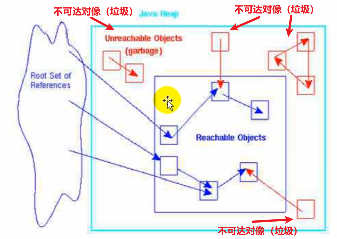


1. GC Roots：所谓GC Roots根集合就是一组必须活跃的**引用**。

   基本思路：

   - 可达性分析算法是以跟对象集合（GC Roots）为起始点，按照从上至下的方式搜索被根对象集合所连接的目标对象是否可达。
   - 使用可达性分析算法后，内存中的存活对象都会被根对象集合直接或间接连接着，搜索所走过的路径成为引用链。
   - 如果目标对象无法通过根对象集合GC Roots中的对象连接到，则是不可达的，意味着该对象已经死亡，可以被标记为垃圾对象。
   - 在可达性分析算法中，只有能够被根对象集合直接或间接连接的对象才是存活的对象。

   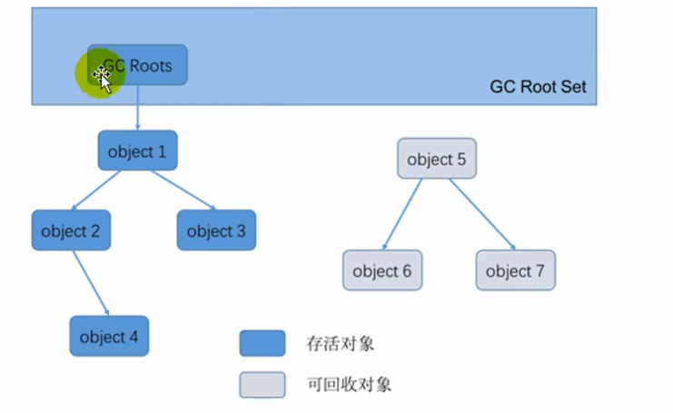

2. 在Java语言中，GC Roots包括以下几类元素：

   - 虚拟机栈中引用的对象：比如各个线程被调用的方法中使用到的参数，局部变量等。

   - 本地方法栈内JNI（通常说的本地方法）引用的对象。

   - Java类的静态变量引用的对象。
   
   - 字符串常量池里引用的对象。
   
   - 所有被同步锁synchronized持有的对象
   
   - Java虚拟机内部的引用：基本数据类型对应的Class对象，一些常驻的异常对象，系统类加载器。
   
3. “临时性”的GC Roots
   
   除了这些固定的GC Roots对象集合以外，根据用户所选用的垃圾收集器以及当前回收的内存区域不同，还可以有其他对象“临时性”地加入，共同构成完整GC Roots集合。比如：分代收集和局部回收（Partial GC）
   
   - 如果只针对Java堆中的某一块区域进行垃圾回收，比如只针对新生代进行的回收。那么必须考虑到虚拟机的运行时内存区域是一个整体，新生代中的对象完全有可能被其他区域的对象所引用，比如老年代。这时候就需要将老年代区域中的对象也加入到GC Roots集合中进行考虑，才能保证可达性分析的准确性。
   
4. 注意：如果要使用可达性分析算法来判断内存是否可回收，那么分析工作必须在一个能保证一致性的快照中进行。不能够在进行可达性分析时，对象的引用情况还会发生变化。如果这点不满足分析的准确性就无法保证。这点也是导致GC进行时必须"Stop The Work"的一个重要原因。枚举根节点时必须要停止用户线程。
   
   
## 4.对象的finalization机制

1. Java语言提供了对象终止finalization机制来允许开发人员提供对象被销毁之前进行的自定义处理逻辑：当垃圾回收器发现没有引用指向一个对象时，在对其进行垃圾回收之前，还会调用一次finalize()方法。

2. finalize()方法允许在子类中被重写，用于在对象被回收时进行资源释放。通常在这个方法中进行一些资源释放和清理的工作，比如关闭文件，套接字和数据库连接等。

   3.垃圾回收机制会自动调用finalize()方法，所以不建议我们主动调用重写的finalize()方法。如果所有的根节点都无法访问到某个对象，说明该对象已经不再被使用了。但是这种对象是可能在finalize()方法中被复活的，由于finalize()方法的存在，虚拟机中的对象一般处于三种可能的状态：

   - 可到达的：从根节点开始，可以到达这个对象
   - 可复活的：对象没有从根节点到其的引用链，但是对象还没有调用过finalize()方法，所以有可能在finalize()中被复活。
   - 不可到达的：对象的finalize()被调用了，并且该对象也没有被复活。或者被复活了一次的对象，在下次GC时，还是没有根节点到其的引用链，那么此时不会再调用finalize()了，直接归类到不可到达的状态成为垃圾。因为finalize()方法只会被调用一次。

3. 判断一个对象objA是否可回收，至少要经历两次标记过程：
   - 如果对象objA到GC Roots没有引用链，则进行第一次标记。
   - 判断该对象是否已经执行过finalize()方法：
     - 如果已经执行过重写的finalize()方法，那么objA则被判定为不可到达的对象，要被回收。
     - 如果objA重写了finalize()方法且还没有被执行过：
       - 那么objA会被插入到F-Queue队列中，由一个虚拟机自动创建的，低优先级的Finalizer线程触发其finalize()方法。
       - 如果objA在finalize()方法中与引用链上的任何一个对象建立了联系，那么objA会被移除“即将回收”集合。在此次GC中不会对其进行回收。
       - 在下次GC时，如果发现objA到GC Roots没有引用链，此时直接将其归类到不可到达的分类，归为垃圾进行回收，不会再调用finalize()方法。

4. 代码演示一下finalize()方法复活对象，且只会被调用一次：

   ```java
   /**
    * 测试Object类中finalize()方法，即对象的finalization机制。
    */
   public class CanReliveObj {
       public static CanReliveObj obj;//类变量，属于 GC Root
   
   
       //此方法只能被调用一次
       @Override
       protected void finalize() throws Throwable {
           super.finalize();
           System.out.println("调用当前类重写的finalize()方法");
           obj = this;//当前待回收的对象在finalize()方法中与引用链上的一个对象obj建立了联系
       }
   
   
       public static void main(String[] args) {
           try {
               obj = new CanReliveObj();
               // 对象第一次成功拯救自己
               obj = null;
               System.gc();//调用垃圾回收器
               System.out.println("第1次 gc");
               // 因为Finalizer线程优先级很低，暂停2秒，以等待它
               Thread.sleep(2000);
               if (obj == null) {
                   System.out.println("obj is dead");
               } else {
                   System.out.println("obj is still alive");
               }
               System.out.println("第2次 gc");
               // 下面这段代码与上面的完全相同，但是这次自救却失败了
               obj = null;
               System.gc();
               // 因为Finalizer线程优先级很低，暂停2秒，以等待它
               Thread.sleep(2000);
               if (obj == null) {
                   System.out.println("obj is dead");
               } else {
                   System.out.println("obj is still alive");
               }
           } catch (InterruptedException e) {
               e.printStackTrace();
           }
       }
   }
   ```

   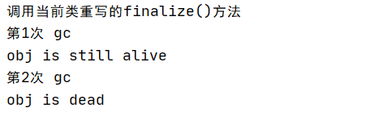
   
5. MAT与JProfiler的GC Roots溯源
   

MAT是Memory Analyzer的简称，它是一款功能强大的Java堆内存分析器，用于查找内存泄漏以及查看内存消耗情况。它是Eclipse开发的，是一块免费的性能分析工具。

   ```java
   public class GCRootsTest {
       public static void main(String[] args) {
           List<Object> numList = new ArrayList<>();
           Date birth = new Date();
   
           for (int i = 0; i < 100; i++) {
               numList.add(String.valueOf(i));
               try {
                   Thread.sleep(10);
               } catch (InterruptedException e) {
                   e.printStackTrace();
               }
           }
   
           System.out.println("数据添加完毕，请操作：");
           new Scanner(System.in).next();
           numList = null;
           birth = null;
   
           System.out.println("numList、birth已置空，请操作：");
           new Scanner(System.in).next();
   
           System.out.println("结束");
       }
   }
   ```

   启动上述代码，在代码运行到new Scanner(System.in).next();时，会被阻塞，我们在此时生成一下dump快照，从jvisulavm导出dump文件。然后放开代码，在运行到第二次new Scanner(System.in).next();时，在生成一下dump快照。然后将两个快照从jvisualvm中导出：

   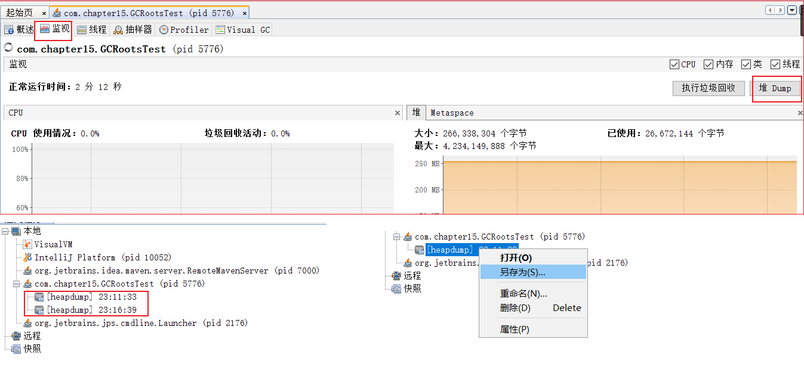

   用MAT打开dump文件：查看GC Roots

   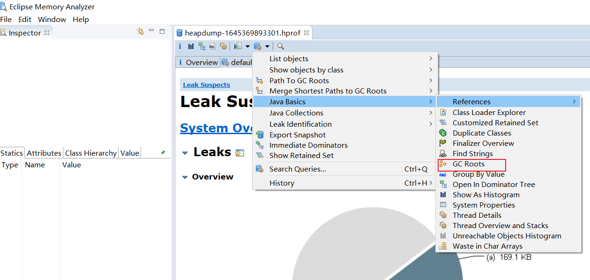

   用JProfile查看具体一个对象被GC Roots中的哪个对象指向：

   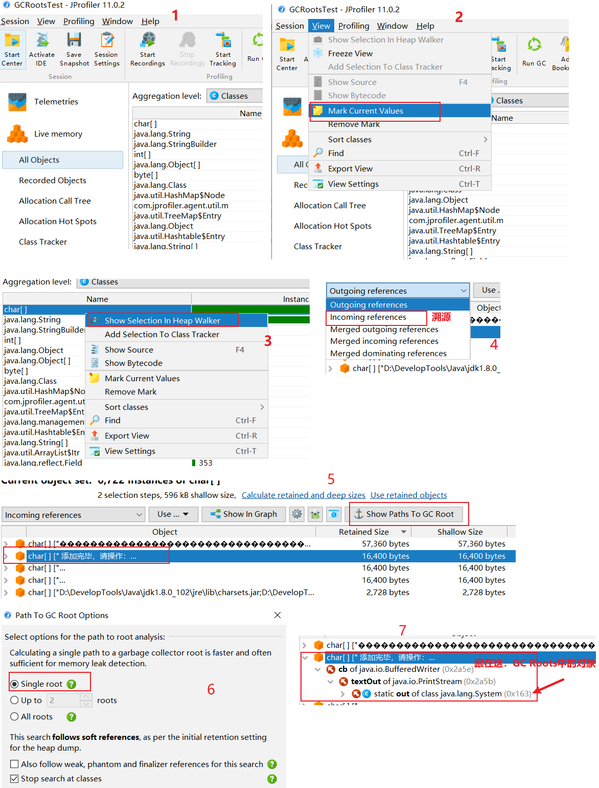

   

   使用JProfile分析OOM：-XX:+HeapDumpOnOutOfMemoryError，当出现OOM生成堆中的dump文件

   ```java
   public class HeapOOM {
       byte[] buffer = new byte[1 * 1024 * 1024];//1MB
   
       public static void main(String[] args) {
           ArrayList<HeapOOM> list = new ArrayList<>();
   
           int count = 0;
           try{
               while(true){
                   list.add(new HeapOOM());
                   count++;
               }
           }catch (Throwable e){
               System.out.println("count = " + count);
               e.printStackTrace();
           }
       }
   }
   ```

   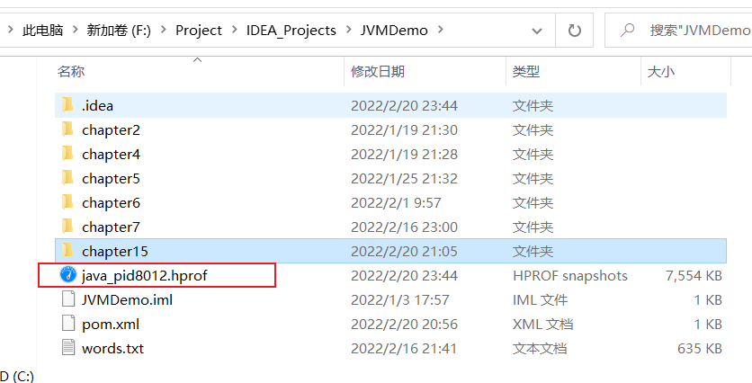

   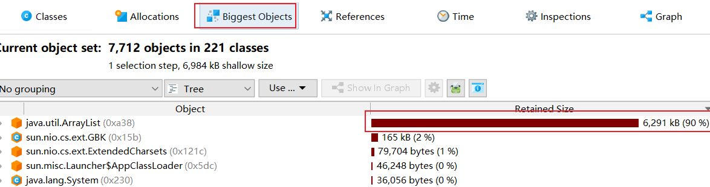

   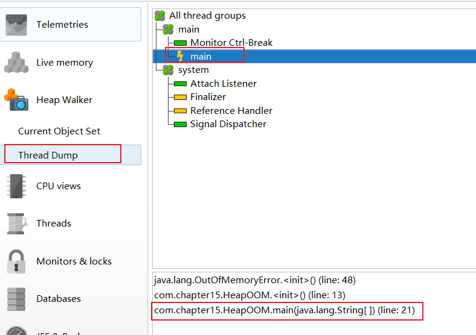

   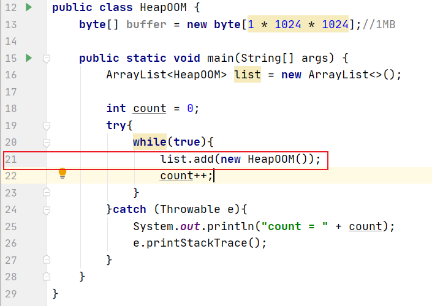

   

## 5.垃圾清除阶段算法：标记-清除算法

1. 背景

   当成功区分出内存中存活对象和死亡对象后，GC接下来的任务就是执行垃圾回收，释放掉无用对象所占用的内存空间以便有足够多可用的内存空间为新对象分配空间。

   目前JVM中比较常见的三种垃圾收集算法是：标记-清除算法（Mark-Sweep），复制算法（Copying），标记-压缩算法（Mark-Compact）。

2. 介绍：

   标记-清除算法（Mark-Sweep）是一种非常基础和常见的垃圾收集算法，该算法被J.McCarthy等人在1960年提出并应用于Lisp语言。

   大致执行过程如下：当堆中的有效内尺寸空间被耗尽时，就会停止整个程序（Stop the World），然后进行两项工作，第一项是标记可达对象，第二项是清除垃圾。

   - 标记：Collector从引用根节点开始遍历，标记所有被引用的对象。一般在对象的对象头Header中记录为可达对象。

   - 清除：Collector对堆内存从头到尾进行线性的遍历，如果发现某个对象在Header中没有标记为可达对象，则将其回收。

3. 何为清除：

   这里所谓的清除并不是真正的置空，而是把需要清除的对象的地址保存在空闲的地址列表中，下次有新对象需要加载时，判断垃圾的位置空间是否足够，如果够就存放。-----本质上覆盖原来的垃圾。

4. 缺点：

   效率不高：设计两次的遍历操作。

   在进行GC的时候，需要停止整个程序导致用户体验差。

   这种方式清理出来的空闲内存是不连续的，产生内存碎片，需要维护一个空闲列表。
   
   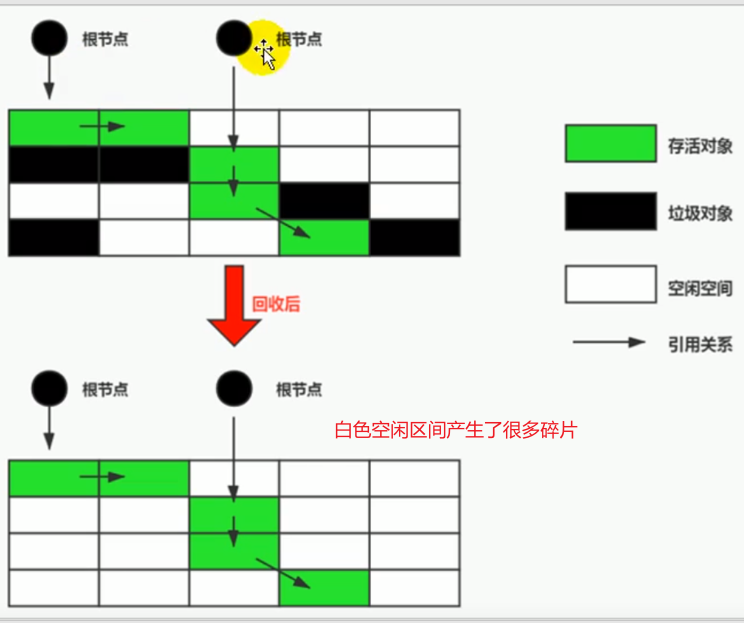
   
   

## 6.垃圾清除阶段算法：复制算法

1. 介绍

   为了解决标记-清除算法在垃圾收集效率方面的缺陷，M.L.Minsky于1963年发表了著名的论文，“使用双存储区的Lisp语言垃圾收集器CA LISP Garbage Collector Algorithm Using Serial Secondary Storage”。M.L.Minsky在该论文中描述的算法被人们称为复制算法，它也被M.L.Minsky本人成功地引入到了Lisp语言的实现版本中。

2. 核心思想：

   将运行时内存空间分为两块，每次只使用其中一块，在垃圾回收时将正在使用的内存中的存活对象复制到1未被使用的内存块中，之后清除正在使用的内存块中的所有对象。交换两个内存的角色，最后完成垃圾回收。

   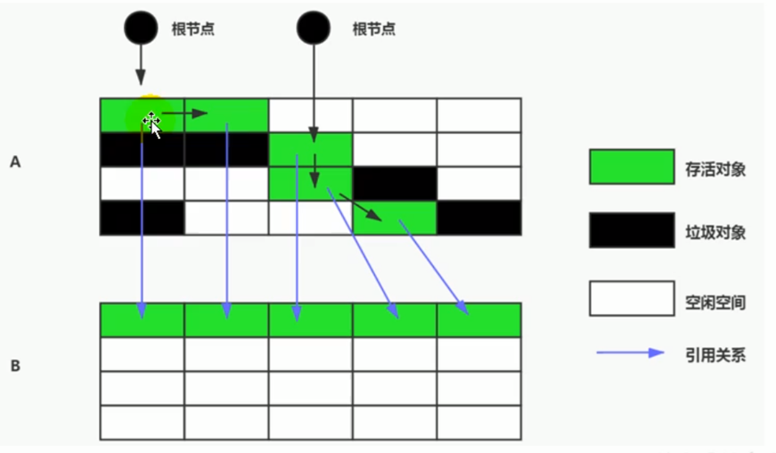

3. 优缺点

   - 优点：
     - 没有标记和清除过程，实现简单，运行高效。
     - 复制过去以后能保证空间的连续性，不会出现“碎片”问题。
   - 缺点：
     - 需要两倍的内存空间
     - 对于G1这种将内存区域分拆成大量Region的GC，复制对象意味着GC需要维护Region之间对象的引用关系。由于所有存活的对象被整个复制到了另一块内存区域，那么这些对象之间的引用关系也要更新改变。所以这个时间开销也不小。
     - 考虑一个极端的情况，在进行复制算法时，发现只有很少的对象需要被清除，那么意味着需要复制大量的对象到另一块内存区域，原先内存区域的大量的存活对象又要销毁，对象之间的引用还要维护。结果就是因为一点点垃圾就要进行如此庞大的一个工程，效率低下且得不偿失。
   - 适合系统中垃圾对象很多，存活对象很少的场景：Young区的Survivor0和Survivor1区采用的就是这种算法。

4. 应用场景

   在新生代，对常规应用的垃圾回收，一次通常可以回收70% - 99%的内存空间。回收性价比很高，所以现在的商业虚拟机都是用这种收集算法回收新生代。

   
## 7.垃圾清除阶段算法：标记-压缩（整理）算法

1. 背景：

   复制算法的高效性时建立在存活对象少，垃圾对象多的前提下的。这种情况在新生代经常发生，但是在老年代更常见的情况是大部分对象都是存活对象。如果依然使用复制算法，由于存活对象较多，复制的成本也将更高。因此基于老年代垃圾回收的特性，需要使用其他的垃圾回收算法。

   标记-清除算法的确可以应用在老年代中，但是该算法在执行完内存回收后还会产生内存碎片，所以JVM的设计者需要在此基础上继续改进。标记-压缩（Mark-Compact）算法由此诞生。

   1970年前后，G.L.Steele，C.J.Chene和D.S.Wise等研究者发布了标记压缩算法，在许多现代的垃圾收集器中，人们都使用了标记-压缩算法或其他改进版本。

2. 大致过程：

   第一阶段和标记清除算法一样，从根节点开始标记所有被引用的对象。

   第二阶段将所有的存活对象压缩到内存的一段，按顺序排放，之后清理剩下的所有空间。

   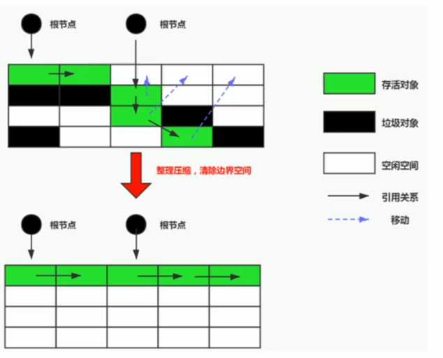

3. 标记-压缩算法的最终效果等同于标记-清除算法执行完成后，再进行一次内存碎片整理，因此也可以把它称为标记-清除-压缩算法。

   二者的本质差异在于标记-清除算法是一种非移动式的回收算法，标记-压缩是移动式的。是否移动回收存活的对象是一项优缺点并存的风险就决策。

   标记的存活对象将会被整理，按照内存地址一次排列，而未被标记的内存会被清理掉。如此一来，当我们需要给新对象分配内存时，JVM只需要持有一个清理出来的内存的起始地址即可，这比维护一个空闲列表少许多开销，在为新的对象分配内存时，采用指针碰撞即可。

4. 指针碰撞（Bump the Pointer）

   如果内存空间以规整和有序的方式分布，即已用和未用的内存都各自存分开，彼此之间维系着一个记录下一次分配内存起始点的标记指针，那么当新对象需要分配内存时，只需要通过修改指针的偏移量将新对象分配在第一个空闲内存位置上，然后将指针向后移动新对象的大小的距离即可。这种分配方式就叫做指针碰撞。

5. 优缺点：

   - 优点
  - 消除了标记-清除算法中存在内存碎片的情况，且不需要维护一个空闲内存列表。只需要记录一个空闲内存的起始地址，通过指针碰撞来为新对象分配内存。
     - 消除了复制算法中需要两倍内存的代价。
- 缺点：
     - 效率是最低的。
     - 移动对象的同时，如果对象被其他对象引用，则还需要调整引用的地址。
     - 移动过程中，需要全程暂停用户应用程序，即STW。


## 8.垃圾清除阶段算法小结：

### 8.1.三种算法比较

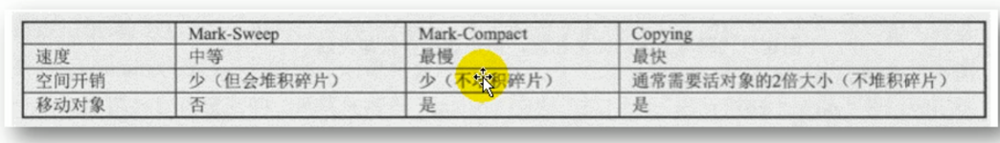

从效率上来说，复制算法是最高效的，但是浪费了太多内存。

标记-整理算法兼顾了空间开销和碎片整理，但是效率确实最低的，比复制算法多了一个标记阶段，比标记-清除算法多了一个整理内存的阶段。

没有最优的算法，只有最合适的算法：

### 8.2.分代收集算法

每种算法都有其各自的优缺点，并没有一种算法可以完全替代其他算法，因此分代收集算法应运而生。分代收集算法是基于这样一种情况：Java堆分成不同的区域，根据各个区域的对象的生命周期的不同，应用对应的垃圾回收算法。

在Hotsopt中基于分代的概念，GC所使用的内存回收算法必须结合年轻代和老年代各自的特点：

- 年轻代：区域相对于老年代较小，对象生命周期短，存活率低，需要频繁回收。这种情况下复制算法的回收整理速度是最快的。因为年轻代中的对象生命周期短，所以存活的对象较少，这种情况就比较适合复制算法，需要复制移动对象较少。该算法具体应用在幸存者Survivor0区和Survivor1区，而且幸存者区本身占用的内存就很小，所以内存利用率的缺点也不会太大。
- 老年代：区域较大，对象生命周期长，存活率高，回收不及年轻代频繁。这种情况存在大量存活率高的对象，复制算法明显变得不合适。一般由标记-清除算法和标记-压缩算法搭配使用。
  - Mark阶段的开销于存活对象的数量成正比
  - Sweep阶段的开销与所管理的区域大小成正比（要遍历整个管理空间，找到所有垃圾对象）
  - Compact阶段的开销与存活对象成正比：存活的越多，整理起来花销越大。

以HotSpot中的CMS回收器为例，CMS是基于Mark-Sweep实现的，主要针对老年代的回收。对于对象的回收效率很高，对于碎片问题CMS采用基于Mark-Compact算法的Serial Old回收器作为补偿措施。当内存回收不佳（比如碎片导致大对象申请不到足够的内存空间Concurrent Mode Failure），将采用Serial Old执行Full GC以达到对老年代内存的管理，对碎片内存在进行整理。

基于内存堆空间分代的思想来具体使用回收算法，分代的思想被现有的虚拟机广泛使用，几乎所有的垃圾回收器都区分新生代和老年代。


## 9.基于降低延迟STW的改进：实时性

### 9.1.增量收集算法

上述现有的算法在垃圾回收过程中，应用程序将处于一种Stop the World的状态，在STW状态下，应用程序的所有工作线程都将挂起，暂停一些正常的工作，等待垃圾回收的完成。如果垃圾回收时间过长，应用程序会被挂起很久，将严重影响用户体验或者系统的稳定性。为了解决这个问题，即对实时垃圾收集算法的研究直接导致了增量手机Increnmental Collecting算法的诞生。

1. 基本思想：

   如果一次性将所有的垃圾进行处理，需要造成系统长时间的停顿，那么就可以让垃圾收集线程和应用线程交替执行。每次垃圾收集线程只收集一小片区域的内存空间，接着切换到应用程序线程。一次反复，直到垃圾收集完成。

   总的来说增量收集算法的基础仍是传统的标记-清除和复制算法。增量收集算法通过协调垃圾回收线程和工作线程交替执行，允许垃圾收集线程分阶段的完成其工作，一定程度上让垃圾收集线程和工作线程并发执行，避免工作线程长时间的等待。

2. 缺点：虽然能减少STW的时间，但是因为垃圾回收线程和工作线程频繁的线程上下文切换，也会造成许多额外的开销，造成系统的吞吐量下降。

### 9.2.分区算法

一般来说在相同条件下，堆空间越大，一次GC时所需要的时间就越长，有关GC产生的停顿也越长。为了更好地控制GC产生的停顿时间，将一块大的内存区域分割成多个小块，每次合理地回收若干小区间，而不是整个堆空间，从而减少一次GC所产生的停顿时间。

分代算法是按照对象的生命周期长短划分成两个部分；分区算法是将整个堆空间划分成连续的不同小区间。每一个小区间都独立使用，独立回收，这种算法的好处是可以减少一次GC所产生的停顿时间。

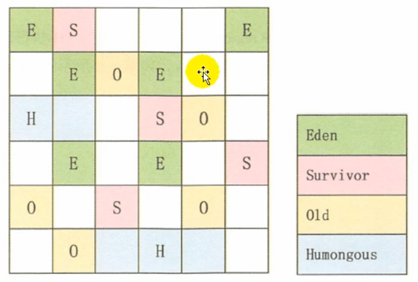


   

   

   

   

   

   

   

   


