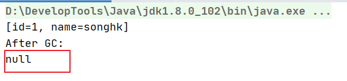

# 12.垃圾回收相关的概念

## 1.System.gc()

- 在默认情况下通过System.gc()或者Runtime.getRuntime().gc()的调用，会显示触发Full GC，同时对老年代，新生代，方法区进行回收尝试释放被丢弃对象占用的内存。

  同时System.gc()的调用附带一个免责声明，无法保证一定会触发垃圾收集。

  垃圾回收应该是自动触发进行的。

  ```java
  public class SystemGCTest {
      public static void main(String[] args) {
          new SystemGCTest();
          System.gc();
  
          //System.runFinalization();//会强制调用失去引用的对象的finalize()方法
      }
  
      @Override
      protected void finalize() throws Throwable {
          //只有进行垃圾回收的时候才会调用finalize方法，但是System.gc()不一定能触发垃圾回收
          super.finalize();
          System.out.println("重写的finalize...");
      }
  }
  ```

- 代码演示一下会被回收的对象的几种情况：

  - 方法1：执行到System.gc()触发垃圾回收时，会停止用户线程，此时方法还没执行完，局部变量表中的buffer引用还存活着，指向的数组对象不会被回收因为还存在指向该对象的引用。

    ```java
    public void localvarGC1() {
        byte[] buffer = new byte[10 * 1024 * 1024];//10MB
        System.gc();
    }
    ```

    

  - 方法2：执行到System.gc()触发垃圾回收时，已经没有引用指向数组对象了，所以数组对象会被回收。

    ```java
    public void localvarGC2() {
        byte[] buffer = new byte[10 * 1024 * 1024];
        buffer = null;
        System.gc();
    }
    ```

    

  - 方法3：先回顾一个知识点。

    栈帧中的局部变量表中的槽位是可以重用的，如果一个局部变量的作用域不是整个方法的话（比如代码块中的变量），那么当过了其作用域后，**在其作用域之后申明的新的局部变量**就很有可能会复用过期的局部变量的槽位，从而达到节省资源的目的。。

    执行到System.gc()触发垃圾回收时，虽然已经在代码块的作用域外了，但是局部变量表中还是有buffer引用的，所以此时还是有引用指向byte[]数组，不会被回收。效果同方法1.

    ```java
    public void localvarGC3() {
        {
            byte[] buffer = new byte[10 * 1024 * 1024];
        }
        System.gc();
    }
    ```

    

  - 方法4：

    执行到System.gc()触发垃圾回收时，此时已经在代码块的作用域外了buffer已经失效了，而且又定义了一个局部变量，那么新的局部变量就会复用原来buffer所占的槽位。所以局部变量表中已经没有有buffer引用了，byte[]数组会被回收。效果同方法2.

    ```java
    public void localvarGC4() {
        {
            byte[] buffer = new byte[10 * 1024 * 1024];
        }
        int value = 10;
        System.gc();
    }
    ```

    

  - 方法5：方法5内部调用了一次方法1，那么方法1中的System.gc不会回收byte[]。当方法1执行完，此时方法1的栈帧销毁，局部变量表也销毁，buffer引用也销毁，没有指向byte[]的引用了，此时再执行一次Sysetem.gc触发GC的话，那么就会回收byte[]。

    ```java
    public void localvarGC1() {
        byte[] buffer = new byte[10 * 1024 * 1024];//10MB
        System.gc();
    }    
    
    public void localvarGC5() {
        localvarGC1();
        System.gc();
    }
    ```

    

## 2.内存溢出和内存泄漏

- 内存溢出：

  由于GC一直在优化发展，所以在一般情况下，除非应用程序占用的内存增长速度非常快，造成垃圾回收已经跟不上内存消耗的速度了，否则不太容易出现OOM的情况。

  大多数情况下，GC会进行各种年龄段的分代垃圾回收，实在不行就放”大招“：来一次独占式的Full GC。这时候会回收大量的内存，供应用程序继续使用。

  javadoc中对OOM的解释是：没有空闲内存，并且垃圾收集器也无法提供更多的内存。这里面隐含的意思是，在抛出OOM之前，垃圾收集器通常都会被触发尽可能的去清理出空间。当然也不是每次都会触发垃圾收集，如果我们分配一个超大的对象，其大小直接超过了堆的最大值，JVM可以判断出即使进行了垃圾收集也无法为其分配空间，所以会直接抛出OOM。

  JDK7及其以前，方法区的实现还是永久代，其空间是由JVM分配的，永久代出现OOM的情况也时有发生。尤其是在运行时存在大量动态类型生成的场合，类似intern字符串缓存占用太多空间（JDK6时字符串常量池还是永久代中），也会导致OOM问题。随着元数据的引用，方法区直接使用本地内存，所以响应的OOM也很少出现了。

- 内存泄漏：Memory Leak

  内存泄漏也称”内存渗漏“，严格来说，只有对象不会再被程序用到了，但是GC又不能回收它们的情况，才叫内存泄漏。

  但实际情况很多时候一些不好的处理会导致对象的生命周期变得特别长，导致该变量长期无法被回收，也可以叫做宽泛意义上的“内存泄漏”：比如一个变量可以定义在方法内，非要定义成一个对象成员变量，甚至static类变量导致该变量无法有效的被回收；或者一些变量根本没有必要将其设置应用程序级别，会话级别，导致其生命周期过长。

  尽管内存泄漏并不会立刻引起程序崩溃，但是一旦发生内存泄漏，程序中可用内存就会被逐步蚕食，直至耗尽所有内存，最终出现OOM异常导致程序崩溃i。

  注意：这里的存储空间并不是物理内存，而是虚拟内存大小，这个虚拟内存大小取决于磁盘交换区设定的大小。

  举一个不算例子的例子：该例子是由引用计数算法导致的，但是JVM在垃圾回收标记阶段没有采用该算法，具体情况是应用计数算法无法回收循环应用的情况：比如两个对象内存在互相指向的成员变量，但是没有外部引用指向它们，就会出现循环引用的情况，但是引用计数算法不会将它们标记成垃圾。

  举例：

  - 1.单例模式：单例的生命周期和应用程序是一样长的，如果单例对象又持有的外部对象的引用的话，那么这个外部对象也不能被回收，会导致内存泄漏。
  - 2.一些需要close的资源未关闭，会导致内存泄漏：比如数据库连接dataSource.getConnection()，网络连接Sockey和IO连接必须手动close，否则不能被回收。
  - 3.内部类会持有外部类的引用，所以如果内部类没有被销毁的化，外部类也会一直存活发生内存泄漏。所以最好使用静态内部类，静态内部类不会持有外部类的引用。


## 3.STW：Stop The World

- Stop-the-World，简称STW，指的是GC事件发生过程中会产生应用程序的停顿。停顿产生时整个应用程序的用户线程都会被暂停，给用户卡顿的感觉，这个停顿称为STW。

  比如在垃圾回收的标记阶段时，因为使用的可达性分析算法需要保证系统在一个一致性的快照中进行分析，所以需要暂停所有的Java用户线程。如果在分析过程中对象的引用关系还在不断变化，那么分析结果的准确性肯定是不准的。

- 被STW中断的应用程序线程会在完成GC之后恢复，频繁中断会让用户感觉不佳，所以我们需要减少STW的发生。

- STW事件和采用哪块GC无关，所有的GC都有这个事件。哪怕是G1也不能完全避免Stop-the-World情况发生，只能说垃圾回收器尽可能地缩短暂停时间。

- STW是JVM在后台自动发起和自动完成的，在用户不可见的情况下，把用户正常的工作线程全部停掉。

- 开发中不要用System.gc();会触发Full GC导致Stop-the-World的发生。

  

## 4.垃圾回收器的并行和并发

  

在谈论垃圾收集器的上下文语境中，并发和并行可以解释为：

- 并行Parallel：指多条垃圾收集线程并行工作，此时用户线程处于等待状态。
- 并发Concurrency：指用户线程和垃圾收集线程并发交替执行，在一段时间段内给人感觉是用户线程与垃圾收集线程同时进行，但实际上还是并发交替执行，因为STW的存在无法达到完全的并行。例如CMS，G1垃圾回收器。


## 5.安全点和安全区域

- 安全点Safe Point：程序执行时并非在所有地方都能停顿下来开始GC，只有在特定位置上才能停顿下来开始GC，这些位置称为“安全点Safe Point”。每个SafePoint都会有一个中断标志位，如果JVM需要进行GC时会将该中断标志置为ture。每个线程运行到Safe Point时都会主动轮询这个标志，如果中断标志为真，则会将自己进行中断挂起，方便GC开始。

  Safe Point的选择很重要，如果太少可能导致GC等待的事件太长。加入需要触发GC时，发现有些线程还没有执行到安全点，并且安全点较少，GC就需要等待较长时间直到线程到达安全点才能开始GC。如果安全点设置太多，每次到达安全点都要轮询是否需要主动挂起。太频繁会导致运行时的性能问题。

  大部分指令的执行时间都非常短暂，通常会根据”是否具有让程序长时间执行的特征“为标准来选择安全点，比如选择一些执行时间比较长的指令作为安全点，比如方法调用，循环跳转，异常跳转。

  在长命令中暂停用户线程执行GC是安全的。

- 安全区域：安全点机制保证了程序运行时，在不太长的时间内就会遇到可进入GC的安全点。但是当程序“不执行”的时候呢？比如线程处于Sleep状态或者Blocked状态，这个时候线程无法响应JVM的中断请求，走到安全点再去中断挂起，JVM也不太可能等待线程被唤醒。对于这种情况，就需要安全区域来解决。

  安全区域是指在一段代码片段中，对象的引用关系不会发生变化，在这个区域中的任何位置开始GC都是安全的。

  - 当线程运行到安全区域的代码时，首先标识已经进入了安全区域，如果这段时间内发生了GC，那么JVM会忽略标识为safe region状态的线程（认为该线程此时是安全的可以进行GC），开始执行GC。
  - 当线程即将离开Safe Region时，会检查JVM是否已经完成GC，如果完成了则继续执行。否则线程必须等待直到收到可以安全离开Safe Region的信号为止。

  

## 6.再谈引用

我们希望能描述这样一类对象：当内存空间还足够时，则保留这些对象在内存中，如果内存空格空间在进行垃圾收集后还是很紧张，**即使这些对象还存在引用关系**，仍然可以抛弃这些对象。

在JDk1.2版本之后，Java对引用的概念进行了扩充，将引用分为强引用（Strong Reference），软引用（Soft Reference），弱引用（Weak Reference）和虚引用（Phantom Reference）4种，这4种引用强度一次逐渐减弱。

除强引用外，其他3种引用均可以在java.lang.ref包中找到它们的身影。如下图，显示了这3种引用类型对象的类，开发人员可以直接在应用程序中使用它们。Reference的4个子类中只有终结器引用是包可见的protected，其他3种引用类型均为public，可以在应用程序中直接使用。


4种引用的简单介绍：

- 强引用（Strong Reference）：最传统的“引用”定义，是指在程序代码之中普遍存在的引用赋值，即类似“Object obj = new Object()”这种引用关系。无论任何情况下，只要强引用关系还在，垃圾收集器就永远不会回收掉存在这种引用的对象。**哪怕要出现OOM了，也不会回收。**
- 软引用（Soft Referecne）：第一次进行回收（仅回收不可达的对象）后发现内存还是不够用，在系统将要发生内存溢出之前，再进行第二次回收，将会把即使存在软引用的对象也列入回收范围之中进行第二次回收。如果在这次回收还没有足够的内存，才会抛出内存溢出异常。**回收一次后发现还是不够，再把软引用也列入收集范围进行一次收集。**所以软引用不会导致OOM，它会被回收，主要是强引用无法被回收导致的OOM。
- 弱引用（Weak Reference）：被弱引用关联的对象只能生存到下一次垃圾收集之前，当垃圾收集器开始工作时，无论内存空间是否足够，都会回收掉被弱引用关联的对象。
- 虚引用（Phantom Referecne）：一个对象是否有虚引用完全不会对其生存时间构成引用，也无法通过虚引用来获得一个对象实例。为一个对象设置虚引用关联的**唯一目的就是能在这个对象被垃圾收集器回收时收到一个系统通知，主要起对象回收的跟踪统计观察作用。**

### 6.1.强引用

在Java程序中，最常见的引用类型就是强引用（普通系统99%以上都是强引用），也就是我们最常见的普通对象引用，也是**默认的引用类型。**当在Java语言种使用new操作符创建一个新的对象，并将其赋值给一个变量的时候，这个变量就成为指向该对象的一个强引用。

强引用的对象是可触及的，垃圾收集器永远不会回收掉被强引用指向的对象。对于被强引用指向的对象，当引用被赋值为Null，或者超出了引用的作用域，该对象就会被当成垃圾，在下次GC时会给回收。相对的软引用，弱引用，虚引用指向的对象是软可触及，弱可触及和虚可触及的，在一定条件下都是可以被回收的。**所以强引用也是造成Java内存泄漏得到主要原因。**

```java
String str1 = new String("a");
String str2 = str1;
```


### 6.2.软引用

软引用是用来描述一些还有用，但非必要的对象，**可以通过软引用访问对象**。

如果第一次进行回收（仅回收不可达的对象）后发现内存还是不够用，在系统将要发生内存溢出之前，再进行第二次回收，将会把即使存在软引用的对象也列入回收范围之中进行第二次回收。如果在这次回收还没有足够的内存，才会抛出内存溢出异常OOM。**即回收一次后发现还是不够，再把软引用也列入收集范围进行一次收集。**垃圾回收器在某个时刻决定回收软可达对象的时候，会清理软引用对象，并把软引用存放到一个引用队列中。

**注意：软引用是内存紧张（但仅仅是够用的）时可能会被回收，但是第一次GC时发现将要OOM时一定会回收。**

所以弱引用不会导致OOM，它会被回收，主要是强引用无法被回收导致的OOM。

场景：软引用通常用来实现内存敏感的缓存，比如高速缓存就有用到软引用。例如MyBatis的缓存就用到了软引用。如果还有空闲内存，就可以暂时保留缓存，当内存不足时会将其清理掉，这样就保证了使用缓存的同时，不会一直消耗内存。

代码描述：在JDK1.2版本之后提供了java.lang.ref.SoftReference类来实现软引用。

```java
Object obj = new Object();
//此时对象既有强引用也有软引用
SoftReference<Object> sf = new SoftReference<Object>(obj);
//销毁强引用，仅剩软引用，软引用才能起作用（会被垃圾回收）
obj = null;
```

代码演示：内存紧张时会回收软引用对象

```java
/**
 * 软引用的测试：内存紧张时即回收软引用对象
 * -Xms10m -Xmx10m -XX:+PrintGCDetails
 */
public class SoftReferenceTest {
    public static class User {
        public User(int id, String name) {
            this.id = id;
            this.name = name;
        }

        public int id;
        public String name;

        @Override
        public String toString() {
            return "[id=" + id + ", name=" + name + "] ";
        }
    }

    public static void main(String[] args) {
        //创建对象，建立软引用
        User u1 = new User(1,"songhk");
        SoftReference<User> userSoftRef = new SoftReference<User>(u1);
        u1 = null;//取消强引用


        //通过软引用获得对象实例
        System.out.println(userSoftRef.get());

        System.gc();
        System.out.println("After GC:");
        System.out.println(userSoftRef.get());//由于堆空间内存足够，所有此时还不会回收软引用的可达对象。

        try {
            //让系统认为内存资源紧张、不够
            //byte[] b = new byte[1024 * 1024 * 7]; 不够会导致OOM
            byte[] b = new byte[1024 * (7168 - 611)]; //会导致内存紧张，但是内存还是够放byte[]的，仍然会回收软引用
        } catch (Throwable e) {
            e.printStackTrace();
        } finally {
            //再次从软引用中获取数据
            System.out.println(userSoftRef.get());//在报OOM之前，垃圾回收器会回收软引用的可达对象。
        }
    }
}
```

- 虚拟机参数：堆设置10m。

- 1.一开始创建一个7m的byte[]，因为堆的总大小是10，新生代占1/3，老年代2/3，都不够所以软引用会被回收且即使回收了还是回报OOM。

  ```java
  byte[] b = new byte[1024 * 1024 * 7];
  //byte[] b = new byte[1024 * (7168 - 611)];
  ```

  

- 2.我们先分析一下新生代和老年代的内存大小，来建一个“合适”大小的byte[]数组

  ```java
  //byte[] b = new byte[1024 * 1024 * 7];
  //byte[] b = new byte[1024 * (7168 - 611)];
  ```

  

- 3.发现老年代总大小7158，已使用618，那么我们建一个7168 - 618大小的数组-

  ```java
//byte[] b = new byte[1024 * 1024 * 7];
  byte[] b = new byte[1024 * (7168 - 611)];
  ```
  
  
  
  在内存紧张时，但还没有OOM，软引用会被回收。而且有时候被回收，有时候没有被回收。所以：**软引用是内存紧张（仅仅是够用的）时可能会被回收。如果第一次GC时就发现将要OOM的话，一定会回收。**
  
  
### 6.3.弱引用 Weak Reference

弱引用也是用来描述那些非必要的对象，在系统进行gc时，只要发现**一个对象只被弱引用指向**，就会回收该对象。但是垃圾收集线程的优先级通常很低，因此并不能立马发现只被弱引用指向的对象，在这种情况下，弱引用对象可能存活较长时间。

弱引用和软引用一样，在构造弱引用时也可以指定一个引用队列，当弱引用对象被回收时，就会加入指定的引用队列，通过这个队列可以跟踪对象的回收情况。

软引用，弱引用都非常适合来保存那些可有可无的缓存数据。如果这么做，当系统内存不足时，这些缓存数据会被回收，不会导致内存溢出。而当内存资源充足时，这些缓存数据又可以存在相当长的时间，从而起到加速系统的作用。

在JDK1.2版本之后，提供了java.lang.ref.WeakReference类来实现弱引用：

```java
Object obj = new Object();//声明强引用
WeakReferenc wr = new WeakReference<Object>(obj);
obj = null;//销毁强引用
```

弱引用对象与软引用对象的最大不同就在于：当GC在进行回收时，需要通过算法检擦是否回收软引用对象，而对于弱引用对象，GC总是进行回收。弱引用对象更容易，更快被GC回收。

WeakHashMap：其中存放的数据，在进行GC时会被回收掉。其中的内部类Entry继承了WeakReference。

```java
public static void main(String[] args) {
    //构造了弱引用
    WeakReference<User> userWeakRef = new WeakReference<User>(new User(1, "songhk"));
    //从弱引用中重新获取对象
    System.out.println(userWeakRef.get());

    System.gc();
    // 不管当前内存空间足够与否，都会回收它的内存
    System.out.println("After GC:");
    //重新尝试从弱引用中获取对象
    System.out.println(userWeakRef.get());
}
```




### 6.4.虚引用 Phantom Reference

也称“幽灵引用”或者“幻影引用”，是所有引用类型中最弱的一个。一个对象是否被虚引用指向，完全不影响其生命周期。如果一个对象仅持有虚引用，那么它和没有引用几乎是一样的，进行GC时会被垃圾回收器回收。

它不能单独使用，也无法通过虚引用来获取被引用的对象。当试图通过虚引用的get()方法获取对象时得到的结果总是Null。

为一个对象设置虚引用关联的唯一目的在于跟踪垃圾回收过程，比如能在这个对象被收集器回收时收到一个系统通知。

虚引用必须和引用队列一起使用，虚引用在创建时必须提供一个引用队列作为参数。当垃圾回收器准备回收一个对象时，如果发现它还有虚引用，就会在回收对象后，见这个虚引用加入引用队列，以通知应用程序对象的回收情况。

```java
Object obj = new Object();//声明强引用
ReferenceQueue phantomQueue = new ReferenceQueue();
PhantomReference<Object> pf = new PhantomReference<Object>(obj, phantomQueue);
obj = null;//销毁强引用
```

由于虚引用可以跟踪对象的回收时间，因此也可以将椅子额资源释放操作放置在虚引用中执行和记录。

```java
public class PhantomReferenceTest {
    public static PhantomReferenceTest obj;//当前类对象的声明
    static ReferenceQueue<PhantomReferenceTest> phantomQueue = null;//引用队列

    public static class CheckRefQueue extends Thread {
        @Override
        public void run() {
            while (true) {
                if (phantomQueue != null) {
                    PhantomReference<PhantomReferenceTest> objt = null;
                    try {
                        objt = (PhantomReference<PhantomReferenceTest>) phantomQueue.remove();
                    } catch (InterruptedException e) {
                        e.printStackTrace();
                    }
                    if (objt != null) {
                        System.out.println("追踪垃圾回收过程：PhantomReferenceTest实例被GC了");
                    }
                }
            }
        }
    }

    @Override
    protected void finalize() throws Throwable { //finalize()方法只能被调用一次！
        super.finalize();
        System.out.println("调用当前类的finalize()方法");
        obj = this;//第一次会复活obj对象
    }

    public static void main(String[] args) {
        Thread t = new CheckRefQueue();
        t.setDaemon(true);//设置为守护线程：在背后默默执行（监控）。注意t线程中有一个while死循环，要让其能自动停下来：当程序中没有非守护线程时，守护线程也就执行结束。
        t.start();

        phantomQueue = new ReferenceQueue<PhantomReferenceTest>();
        obj = new PhantomReferenceTest();
        //构造了 PhantomReferenceTest 对象的虚引用，并指定了引用队列
        PhantomReference<PhantomReferenceTest> phantomRef = new PhantomReference<PhantomReferenceTest>(obj, phantomQueue);

        try {
            //不可获取虚引用中的对象
            System.out.println(phantomRef.get());

            //将强引用去除
            obj = null;
            //第一次进行GC,由于对象可复活，GC无法回收该对象
            System.gc();
            Thread.sleep(1000);
            if (obj == null) {
                System.out.println("obj 是 null");
            } else {
                System.out.println("obj 可用");
            }
            System.out.println("第 2 次 gc");
            obj = null;
            System.gc(); //一旦将obj对象回收，就会将此虚引用存放到引用队列中。
            Thread.sleep(1000);
            if (obj == null) {
                System.out.println("obj 是 null");
            } else {
                System.out.println("obj 可用");
            }
        } catch (InterruptedException e) {
            e.printStackTrace();
        }
    }
}
```

### 6.5.终结器引用 FinalReference

`java.lang.ref.FinalReference`

它用以实现对象的finalize()方法，也可以称为终结器引用，无需手动编码，其内部配合引用队列使用。

在GC时，终结器引用入队。由Finalizer线程通过终结器引用找到被引用对象并调用它的finalize()方法，第二次GC时才能回收被引用对象。