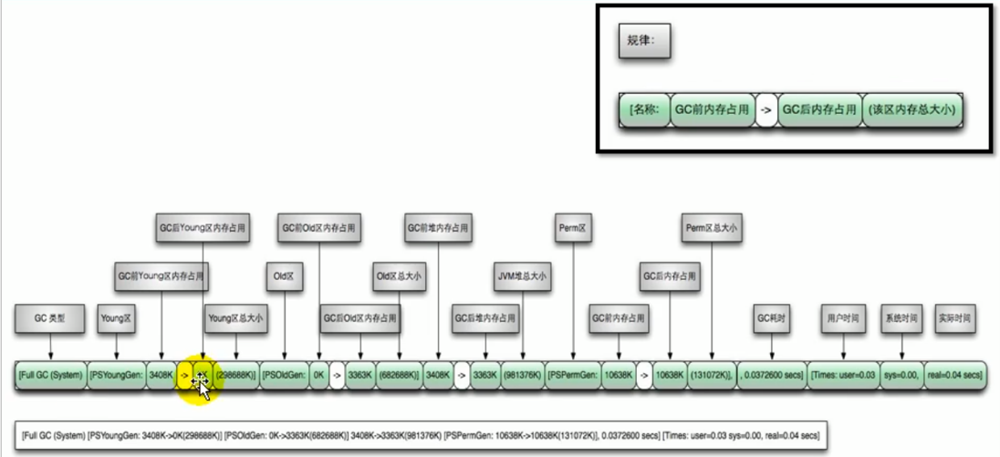

# 13.垃圾回收器

## 1.GC分类与性能指标

垃圾收集器没有在规范中进行过多的规定，可以由不同的厂商，不同版本的JVM来实现。由于JDK的版本处于高速迭代过程中，因此Java发展至今已经衍生了众多的GC版本。

从不同角度分析垃圾收集器，可以将GC分为不同的类型。

### 1.1.垃圾回收器分类

1. 按垃圾回收的线程数来分，可以分为串行垃圾回收器和并行垃圾回收器。

   都是独占式，采用STW机制。

   

   - 串行回收指的是在同一时间段内只允许有一个CPU用于执行垃圾回收操作，此时工作线程被暂停，直至垃圾收集工作结束。
     - 在诸如单CPU处理器或者较小应用内存等硬件平台不是特别优秀的场合，串行回收器的性能表现可以超过并行回收器和并发回收器。所以串行回收被默认应用在客户端的Client模式下的JVM中。64位机器都是Server模式的JVM。
     - 在并发能力比较强的CPU上，并行回收器产生的停顿时间要短于串行回收器。
   - 并行收集可以运行多个CPU同时执行垃圾回收，因此提升了应用的吞吐量，不过并行回收仍然与串行回收一样采用独占式，垃圾回收线程工作时，工作线程被暂停，使用了STW机制。

2. 按照工作模式分类，可以分为并发式垃圾回收器和独占式垃圾回收器。

   

   - 并发式垃圾回收器与应用程序线程交替工作，以尽可能减少应用程序的停顿时间。

   - 独占式垃圾回收器一旦运行，就会停止应用程序中的所有用户线程，直到垃圾回收过程完全结束。串行垃圾回收器和并行垃圾回收器都属于独占式垃圾回收器。

3. 按碎片处理方式分类，可以分为压缩式垃圾回收器和非压缩式垃圾回收器

   - 压缩式垃圾回收器会在回收完成后，对存活对象进行压缩整理，消除回收后的碎片。再为对象分配空间时，使用指针碰撞。
   - 非压缩式的垃圾回收器不进行这步操作。再为对象分配空间时，使用空闲列表。
4. 按工作的内存区间分类，可以分为年轻代垃圾回收器和老年代垃圾回收器。
   
### 1.2.评估GC的性能指标

- **吞吐量**：运行用户代码的时间占总运行时间的比例。总运行时间=程序的运行时间+内存回收的时间
- 垃圾收集开销：吞吐量的补数，垃圾收集所占用的时间与总运行时间的比例。
- **暂停时间**：执行垃圾收集时，程序的工作线程被暂停的时间。
- 收集频率：相对于应用程序的执行，收集操作发生的频率。
- **内存占用**：Java堆区所占的内存大小。
- 快速：一个对象从诞生到被回收所经历的时间。

吞吐量，暂停时间，内存占用着三者共同构成了一个“不可能三角”。一款优秀的收集器通常最多同时满足其中的两项。这3项里，暂停时间的重要性日益凸显。因为随着硬件发展，能提供更多的内存占用，更大的内存提供也有助于提高系统的吞吐量。但是随着内存增大，当发生GC时，就需要更多的暂停时间，带来更大的延迟。

垃圾收集器主要关注两点性能指标：吞吐量，暂停时间。

1. 吞吐量Throughput：

   吞吐量就是CPU用于运行用户代码的时间与CPU总消耗时间的比值，即吞吐量 = 运行用户代码时间 / （运行用户代码时间 + 垃圾收集时间）。

   比如虚拟机总共运行了10分钟，其中垃圾收集花掉1分钟，那吞吐量就是99%。

   注重吞吐量的话，应用程序就要忍受每次GC时造成较高的暂停时间。

   

2. 暂停时间 Pause Time

   “暂停时间”是指垃圾回收线程执行时，导致的用户线程暂停的时间。
   
   暂停时间优先，意味着尽可能让**单次**STW的时间最短。
   
   
   
3. 吞吐量VS暂停时间
   
   高吞吐量能让应用程序尽可能的在做“生产性”工作，程序的执行效率更高。
   
   低暂停（延迟）时间在交互式应用程序中更为关注，暂停时间过程给中断用户带来非常不好的影响。
   
   高吞吐量和第暂停时间是一对相互竞争的指标：
   
   - 如果以高吞吐量优先，那么必然需要降低内存回收的执行频率，但是这样会导致**单次GC需要更长的暂停时间**来执行内存回收。
   - 如果以低暂停时间优先，假设每次产生较少的垃圾就开始进行收集，会导致更加频繁的执行内存回收，虽然每次执行内存回收的暂停时间较短，但是总的暂停时间会提高，反而降低程序的吞吐量。
   
4. 在设计或使用GC算法时，我们必须确定我们的目标：一个GC算法只能针对上述两个指标之一，要么吞吐量优先，要么低延迟优先，然后再从两者找到一个折衷的方案。
   
   现在标准：在最大吞吐量优先的情况下，降低停顿时间。
   
   
## 2.不同的垃圾回收器概述

垃圾收集机制是Java的招牌能力，极大地提高了开发效率。

垃圾收集器发展史：


1. 7款经典的垃圾收集器：

   - 串行回收器：Serial，Serial Old

   - 并行回收器：ParNew，Paraller Scavenge，Paraller Old

   - 并发回收器：CMS，G1

     

2. 7款经典收集器与垃圾分代之间的关系。

   我们直到堆是分老年代和新生代的，很多垃圾回收器又只会针对某一区域进行回收。

   新生代收集器：Serial, ParNew, Paraller Scavenge

   老年代收集器：Serial Old，Paraller Old，CMS

   整堆收集器：G1

   

3. 垃圾回收器的组合

   

   - 两个收集器之间有连线（包括虚线），表明它们可以搭配使用：

     Serial/Serial Old；Serial/CMS；ParNew/Serial Old；ParNew/CMS；Paraller Scavenge/Serial Old；

     Paraller Scavenge/Paraller Old；G1

   - 其中Serial Old作为CMS出现"Concurrent Mode Failure"失败得到后备方案：CMS回收器不能在老年代满的时候才回收，要提前回收，因为它是并发的。意味着和工作线程并发时可能还会产生新的垃圾，如果产生垃圾的速度大于回收垃圾的速度，那么就会回收失败，此时就由Serial Old这个串行垃圾回收器这个后备方案来触发Full GC执行垃圾回收。

   - 红色虚线：由于维护和兼容性测试的成本，在JDK8时将Serial+CMS，ParNew+Serial Old这两个组合声明为废弃，并在JDK9中完全取消了这些组合的支持（即移除）。
   
   - 绿色虚线：在JDK14中，弃用了Paraller Scavenge和Serial Old这个组合。
   
     **两个虚线表明了尽量保留并行回收器相互间组合，串行回收器相互组合。**
     
   - 青色虚线：JDk14中删除，删除CMS垃圾回收器。
     
   - **JDK8中用的是Paraller Scavenge+Paraller Old**
   
4. 为什么要有很多垃圾收集器，一个不够吗？
   
   因为Java的使用场景很多，移动端，服务器等。所以就需要针对不同的场景，提供不同的垃圾收集器，提高垃圾收集的性能。
   
   虽然我们会对各个收集器进行比较，但并非为了挑选一个最好的收集器出来。没有一种放之四海而皆准，任何场景下都适用的完美收集器存在，更加没有万能的收集器。所以我们选择的只是对具体应用最合适的收集器。
   
5. 查看默认收集器
   
   -XX:+PrintCommandLineFlags：打印命令行相关参数（包含使用的垃圾收集器）
   
   
   
   使用命令行指令：jinfo -flag 相关垃圾回收器参数 进程ID
   
     
   
   上图说明：使用ParallelGC时会自动关联ParallelOldGC作为老年代的收集器。

## 3.Serial回收器-串行回收

Serial收集器时最基本，历史最悠久的垃圾收集器了。JDK1.3之前回收新生代唯一的选择。Serial是HotSpot在Client模式下的默认新生代垃圾收集器。

Serial收集器采用复制算法，串行回收和“Stop-the-World”机制的方式执行内存回收。

除了新生代之外，Serial收集器还提供了用于执行老年代垃圾收集的Serial Old收集器。Serial Old收集器同样采用了串行回收和STW机制，只不过内存回收算法使用的是标记-压缩算法：

- Serial Old是运行在Client模式下默认的老年代垃圾回收器。
- Serial Old在Server模式下主要有两个用途：与新生代的Paraller Scavenge配合使用；作为老年代CMS收集器的后备垃圾收集方案。

串行回收：不仅仅意味着使用一条收集线程去完成垃圾收集工作，还说明它在进行垃圾收集时，必须暂停其他所有的工作线程，直到它收集结束。

 

优势：在单线程的场景中简单且高效，此时没有其他线程交互的开销，专心做垃圾收集工作。

场景：一般适用于单核cpu的设备，比如嵌入式场景。一般在Java应用程序中是不会采用串行垃圾收集器的。

参数：-XX:+UseSerialGC参数可以指定年轻代和老年代都是用串行收集器。新生代用Serial GC且老年代用Serial Old GC。


## 4.ParNew回收器-并行回收

如果说Serial GC是年轻代中的单线程垃圾收集器，那么ParNew收集器可以理解为Serial收集器的多线程版本。Par是Parallel的缩写，New指针对年轻代的回收。

由于ParNew收集器采用并行回收的方式执行内存回收，所以STW的时间较Serial串行回收要少。除此之外两款垃圾收集器之间区别很小，ParNew收集器在年轻代中同样采用复制算法，STW机制。

ParNew是很多JVM运行在Server模式下的新生代默认垃圾收集器。

搭配：对于新生代，回收次数频繁，使用并行方式高效。对于老年代，回收次数少，使用串行方式搭配Serial Old垃圾收集器节省资源。


由于ParNew收集器是基于并行回收，那么是否可以断定ParNew收集器的回收效率在任何场景下都会比Serial收集器高效呢？

- ParNew收集器运行在多CPU的环境下，由于可以充分利用多CPU，多核心等物理硬件资源优势，可以更快速地完成垃圾收集，提升程序的吞吐量。
- 但是在单个CPU的环境下，ParNew收集器效率低于Serial收集器。因为Serial收集器是单线程串行回收的，在只有一个CPU的情况下，不像并行那样需要竞争CPU资源，进行上下文切换这种耗费效率的操作。

目前只有Serial 和 ParNew GC能与CMS收集器配合工作。

参数：在程序中开发人员可以通过选项"-XX:+UseParNewGC"手动指定使用ParNew收集器执行内存回收任务。它表示年轻代使用并行收集器ParNew，但不影响老年代的垃圾收集器的选择、-XX:ParallelGCThreads限制垃圾收集线程数量，默认值等于CPU数。

**目前也基本不再使用了：其搭配的Serial Old和CMS在后续的JDK版本中都被移除了，相当于被孤立的，不再使用了。**


## 5.Parallel Scavenge回收器-吞吐量优先

HotSpot的年轻代中除了拥有ParNew收集器是基于并行回收的以外，Parallel Scavenge收集器同样也采用了复制算法，并行回收和“Stop-the-World”机制。那么Parallel收集器的出现是否多次一举呢？

- 和ParNew收集器不同，Parallel Scavenge收集器的目标是吞吐量优先，它也被称为吞吐量优先的垃圾收集器。
- 自适应调节策列也是Parallel Scavenge与ParNew的一个重要区别：在整合JVM运行过程中，根据当前运行的情况，进行性能的监控，动态调整内存的分配情况，以达到目标要求下（吞吐量优先）的最优策略。
  - 在这种模式下，年轻代的大小，Eden和Survivor的比例，晋升老年代的对象年龄等参数会被自动调整，以达到在堆大小，吞吐量和停顿时间之间的平衡点。
  - 在手动调优比较困难的场合，可以直接使用这种自适应的方式，仅指定虚拟机的最大堆，目标的吞吐量（GCTimeRation）和停顿时间（MaxGCPauseMills），让虚拟机自己完成调优工作。

高吞吐量优先：意味着高效率地利用CPU时间，尽快完成程序的运算任务，**主要适合在后台运算而不需要太多交互的任务**。因此常见在服务器环境中使用。例如：执行批处理任务，订单处理，工资支付，科学计算的应用程序。

Parallel Old收集器：Parallel收集器在JDK1.6时提供了用于执行老年代垃圾收集的Parallel Old收集器，用来代替老年代的Serial Old串行收集器。Parallel Old收集器也采用了标记-压缩算法，但同样也是基于并行回收和STW机制。


在Java8中，默认的垃圾收集器就是Parallel Scavenge/Parallel Old。在程序吞吐量优先的应用场景中，Parallel收集器和Parallel Old收集器的组合，在Server模式下的内存回收性能很不错。

参数配置：


## 6.CMS回收器-低延迟

### 6.1.CMS介绍

在JDK1.5时期，HotSpot推出了一款在强交互应用中占有划时代意义的垃圾收集器：CMS Concurrent-Mark-Sweep收集器，这款收集器是HotSpot虚拟机中第一款真正意义上的**并发收集器，它第一次实现了让垃圾收集线程与用户线程同时工作。**

CMS收集器的关注点是尽可能的缩短垃圾收集时用户线程的停顿时间，停顿时间越短就越适合注重与用户交互的程序，良好的响应速度能提升用户体验。目前很大一部分的Java应用集中在互联网站或者B/S系统的服务端上，这类应用尤其重视服务的响应速度，希望系统停顿时间最短，以给用户带来较好的体验。CMS收集器就非常符合这类应用的需求。

不幸的是，CMS作为老年代的收集器，却无法与JDK1.4.0中已经存在的新生代收集器Parallel Scavenge配合工作，因为Parallel Scavenge和Parallel Old这两个垃圾收集器用的框架是类似的，且和其他垃圾收集器不同，所以和其他垃圾收集器搭配不好。在JDK1.5中使用CMS来收集老年代时，新生代只能选择ParNew或者Serial收集器。相应的新生代搭配的垃圾收集器是ParNew GC。

CMS的垃圾收集算法采用标记-清除算法，并且也会STW。在G1出现之前，CMS使用还是非常广泛的，一直到今天，仍然有很多系统使用CMS GC。

### 6.2.CMS的工作原理


CMS整个过程比之前的收集器要复杂，整个过程分为4个主要阶段，即初始标记阶段，并发标记阶段，重新标记阶段和并发清除阶段。

- 初始标记 Initial_mark 阶段：在这个阶段中，程序中所有的工作线程都将会因为STW机制而出现断在的暂停，这个阶段的主要人物额仅仅是标记处GC Roots能**直接关联到的对象**。一旦标记完成之后就会恢复之前被暂停的所有应用线程，由于直接关联对象比较少，所以这里的速度非常快，STW的时间很短暂。
- 并发标记 Concurrent-Mark 阶段：从GC Roots的直接关联对象开始遍历整个对象图，标记出垃圾的过程，这个过程耗时较长但是不需要暂停用户线程，**可以与用户线程并发运行。**
- 重新标记 Remark 阶段：由于在并发标记阶段中，程序的工作线程会和垃圾收集线程同时运行或者交叉运行，可能导致标**在并发标记阶段期间被标记为垃圾的对象**在之后因用户程序线程继续运行，导致标记产生变动（被标记成垃圾的又被使用了）。在重新标记阶段重新为其进行标记。这个阶段的停顿时间STW通常会比初始标记阶段稍长一些。但毕竟只是修正的问题，所以相比与其他的垃圾收集器的STW也比较短。
- 并发清除 Concurrent-Sweep 阶段：此阶段清除删除标记阶段判断的已经是垃圾的对象，释放内存空间。由于不需要移动存活对象，所以这个阶段也是可以与用户线程同时并发的。会产生内存碎片。

### 6.3.CMS的低延迟分析

尽管CMS收集器采用的是非独占式的并发回收，但是在其初始化标记阶段和重新标记阶段让然需要执行STW机制，暂停程序中的所有工作线程，不过暂停时间并不会太长，因此可以说目前所有的垃圾收集器都做不到完全避免SWT，只能尽可能避免缩短暂停时间。

由于最好费时间的并发标记阶段与并发清除阶段都不需要暂停工作线程，所以整体的回收时地延迟的。

另外由于在整个垃圾收集阶段，用户线程没有完全中断。那么要确保用户线程在运行时有足够多的内存供其使用，CMS是针对老年代的垃圾收集器，但是CMS收集器不能像其他收集器那样等到老年代完全被填满了再进行回收，而是**当堆内存使用率达到某一阈值时，便开始进行回收**，以确保应用程序在CMS工作过程中仍然有足够的空间支持应用程序运行。要是CMS运行期间预留的内存无法满足程序需要，就会出现一次“Concurrent Mode Failure”失败，这时虚拟机将启动后备预案：启用Serial Old收集器重新对老年代进行垃圾回收，又重新进行一次Full GC，而且时单线程的Serial收集器，这样停顿时间就很长了。

标记清除算法：CMS收集器的垃圾收集算法采用的是标记-清除算法，这意味每次执行完内存回收后，由于被执行内存回收的无用对象所占用的内存空间极有可能是不连续的一些内存块，不可避免地将会产生一些内存碎片。那么CMS在为新对象分配内存空间时，将无法使用指针碰撞技术，而只能够选择空闲列表进行内存分配。

既然标记清除算法会造成内存碎片，为什么不采用标记压缩算法呢？因为CMS是低延迟优先的，而进行内存压缩的过程必须要暂停整个用户线程，这样反而提高了整个的延迟时间。标记清除算法不适合低延迟优先的场景。

CMS的优点：并发收集，低延迟。

CMS的缺点：

- 会产生内存碎片，导致在并发清除后，用户线程可用的内存空间无法为大对象分配空间，不得不提前触发Full GC。
- 总吞吐量下降：在并发阶段，它虽然降低了用户停顿时间，但是会因为占用了一部分线程而导致应用程序变慢，总吞吐量下降。
- CMS收集器无法处理浮动垃圾：可能出现“Concurrent Mode Failure”失败而导致额外的一次Full GC的产生。在并发标记阶段由于程序的工作线程和垃圾收集线程是同时运行或者交叉运行的，那么在**并发标记阶段如果产生新的垃圾对象，CMS将无法对这些垃圾进行标记**，最终会导致这些新产生的垃圾对象没有被及时回收，从而只能在下一次执行GC时释放之前这些未被回收的内存空间。

CMS的参数设置：


### 6.4.CMS收集器小结

HotSpot有那么多垃圾收集器，那么怎么选择呢？

- 如果想要最小化使用内存和并行开销，在单核CPU下：请选择Serial GC + Serial Old。
- 如果想要最大化应用程序的吞吐量，不是很在意STW导致的延迟时间：请选择Parallel Scavenge GC + Parallel Old。
- 如果想要最小化GC导致的延迟时间：请选择：CMS GC + ParNew。

JDK后续版本中CMS的变化：主要考虑到CMS的弊端

- JDK9新特性：CMS被标记为Deprecate了，如果对JDK9及以上的版本的HotSpot虚拟机使用参数-XX:+UseConcMarkSweepGC来开启CMS收集器的话，用户会收到一个警告信息，提示CMS未来将会被废弃。

- JDK14新特性：删除了CMS垃圾回收器，如果在JDK14中使用-XX:+UseConcMarkSweepGC来开启CMS收集器的话，JVM不会报错只是给出一个warning信息，而且JVM仍然还是用默认的GC方式启动JVM。

  


## 7.G1回收器-区域化分代式

### 7.1.G1介绍

我们前面已经学习了6种垃圾回收器，其中有注重高吞吐量的Paraller GC，也有注重低延迟的CMS。既然我们已经有了前面几个强大的GC，为什么还要发布Garbage First呢？

​	原因就在于应用程序所应对的业务越来越庞大，复杂，用户越来越多，没有GC机制的话就不能保证应用程序正常进行。而每个GC都不能避免STW，经常造成STW的GC又跟不上实际的需求，所以才会不断地尝试对GC进行优化。G1垃圾回收器是在Java 7 update 4之后引入的一个新的垃圾回收器，是当今收集器技术发展的最前沿成果之一。

​	与此同时，也是为了适应现在不断扩大的内存和不断增加的处理器数量，从而进一步降低暂停时间，所以不断研发更先进的GC。

方法给G1设定的目标是在延迟可控（因为在进行垃圾回收时，暂停用户线程是不可避免的，那么我们要尽可能在满足我们用参数设置的延迟时间内获得更高的吞吐量）的情况下获得尽可能高的系统吞吐量，所以才担当起“全功能收集器”的重任和期望。

为什么叫做Garbage First G1呢？

​	因为G1是一个并行回收器，它把堆内存分割为很多不想管的区域Region（物理上是不连续的）。使用不同的Region来表示Eden，幸存者0区，幸存者1区，老年代等。G1垃圾回收器有计划地避免在整个Java堆中进行全区域的垃圾收集。G1跟踪衡量各个Region里面垃圾堆积的价值大小（该区域回收后所获得的空间大小以及所需要的时间），在后台维护一个优先列表，每次根据允许的收集时间，优先回收价值最大的Region。由于这种方式的侧重点在于回收垃圾最大量的区域Region，所以我们给G1一个名字：垃圾优先Garbage First。

G1是一款面向服务端应用的垃圾收集器，主要针对配备多个CPU以及大容量内存的机器（**因为G1可以不一次性回收完整个年轻代或者老年代或者整个堆区，它是以Region为单位进行回收的，这样它的STW时间就比较低。其他的垃圾收集器如果用大堆的话，因为回收是以堆中的分代为单位的，所以如果堆比较大，那么新生代老年代也比较大，回收起来就会比较耗时，尤其是标记阶段，要扫描整个堆，STW时间也比较长。G1因为以Region为单位进行回收的，这样它的STW时间就比较低。**），能极大概率的满足我们预先设置的GC停顿时间，同时还兼容高吞吐量的性能特征。在JDK1.7版本正式启用，并且移除了Experimental试验阶段的标志，是JDK9以后默认的垃圾收集器，取代了CMS回收器以及Parallel + Parallel Old的组合，被Oracle官方称为“全功能的垃圾收集器”。与此同时CMS已经在JDK9中被标记为废弃，在JDK8中还不是默认的垃圾回收器，需要使用-XX:+UseG1GC来启用。

### 7.2.G1回收器的特点（优势）

与其他GC收集器相比，G1使用了全新的分区算法，其特点如下：

- 并行与并发：

  - 并行性：G1在回收期间，可以有多个GC线程同时工作，有效利用多核计算能力，此时用户线程STW。
  - 并发性：G1拥有与应用程序交替执行的能力，部分工作可以和应用程序同时执行。因此一般来说，不会在整个回收阶段发生完全阻塞应用程序的情况。

- 分代收集

  - 从分代上看，G1依然属于分代型垃圾回收器，它会区分年轻代和老年代，年轻代依然有Eden区和Survivior区。但从堆的结构来看，它不要求整个Eden区，年轻代或者老年代是连续的，也不要求固定大小和固定比例数量。

  - 将堆空间分成相同大小的若干区域Region，这些区域构成了逻辑上的年轻代和老年代

    

  - 和之前的各类回收器不同，它同时收集年轻代和老年代。

- 空间整合

  - CMS：标记-清除算法，会产生内存碎片，若干次GC后要进行一次内存整理。
  - G1将内存划分为一个个的Region，**内存的回收是以Region作为基本单位的。**Region内的回收是基于复制算法的，但若干个Region整个上又是标记-压缩算法，这样避免了内存碎片，有利于程序长时间运行。分配大对象时不会因为无法找到连续内存空间而提前触发下一次GC。尤其是当Java堆非常大的时候，G1的优势更加明显。

- 可预测的停顿时间模型

  软实时Soft Real-Time，很大概率能满足我们设置的延迟时间，这是G1相对于CMS的另一大优势。

  G1除了追求低延迟外，还能建立可预测的停顿时间模型，能让使用者明确指定在消耗在垃圾收集上的时间不超过N毫秒，因为G1是以Region为单位进行收集的，停顿时间较好把握。

  - 由于分区的原因，G1可以只选取部分区域进行内存回收，这样缩小了回收的范围，因此较好的控制全局停顿情况。
  - G1跟踪各个Region里面的垃圾堆积的价值大小（很亮回收后所获得的空间大小以及时间成本），在后台维护一个优先列表，每次根据允许的收集时间，优先回收价值最大的Region。保证了G1收集器在有限的时间内可以获取尽可能高的收集效率（收集价值高的Region）。
  - 相比于CMS，G1未必能做到CMS在最好情况下的延迟停顿，但是在最坏情况下表现要比CMS好得多。

缺点：明显能感觉出对堆空间分代后又继续分区Region，这方面的管理就要耗费额外的开销。G1在进行垃圾收集时产生的内存占用还有其他的执行负载（机制更复杂，维护的机制和成本也更大）都要比CMS高。G1在小内存应用上的表现不佳低于CMS，在大内存上才能发挥其优势。所以其实也是空间换时间，但是时间是无价的。相比于其他垃圾回收器可能要多占同10-20的内存空间。


### 7.3.G1的相关参数和应用场景


G1回收器的使用步骤：

- 开启G1垃圾收集器
- 设置堆的最大内存
- 设置最大的停顿时间

因为G1即回收新生代也回收老年代，所以G1中提供了三种垃圾回收模式：**YoungGC, Mixed GC和Full GC**，在不同的条件下被触发。

G1回收器的适用场景：

- 面向服务端应用，针对具有大内存，多处理器的机器（在普通大小的堆里表现并不惊喜）。
- **最主要的应用是需要低GC延迟，并具有大堆的应用程序。**如堆大小约6GB或更大时，可预测的暂停时间可以低于0.5秒；G1通过么此只清理一部分而不是全部的Region的增量式清理来保证每次GC停顿时间不会过长。
- 在下面的情况能替换CMS收集器：超过50%的Java堆被活动数据占据；对象分配频率或年代提升频率变化很大；GC停顿时间过长。
- HotSpot垃圾收集器里，除了G1意外，其他的垃圾收集器使用的都是内置的JVM线程执行GC的多线程操作。而G1可以采用应用线程承担一部分GC的后台工作，即当JVM的GC线程处理速度慢时，系统会调用应用程序线程帮助加速垃圾回收过程。但是会降低吞吐量，所以会不会适用应用程序线程帮助GC，要看JVM动态衡量和分配。

### 7.4.Region


适用G1收集器时，它会将这个Java堆划分成大约2048个独立的Region块，每个Region块的大小在根据堆空间的实际大小而定，整体控制在1MB-32MB之间的2的N次幂。在JVM生命周期中，Region的大小相同且不会改变。

Region只能时Eden，Survivior，Old中的一种，但是它的身份是不固定的，在垃圾回收的过程中会发生改变。具体看再被从空闲列表调出来时，哪一部分占用了这个Region。

G1垃圾收集器还增加了一种新的内存区域，叫做Humongous内存区域，如图中的H块，主要用于存储大对象，如果大对象超过1.5Region就放到H。**Humongous是一块内存区域，不是Region。**

设置Humongous块的原因：当出现了大对象，而且Eden区（新生代）中放不下，那么就会默认直接分配到老年代。如果这个对象是一个短期存在的大对象，由于被放置到老年代中，不能及时的触发GC将其回收，那么就造成了内存的浪费，一定程度上的内存泄漏。为了解决这个问题，G1划分了一个Humongous区，它用来专门存放大对象。如果一个H区还放不下这个大对象，那么G1会寻找连续的H区来存储。为了能找到连续的H区，有时候不得不启动Full GC整理出来内存区域。**G1的大多数行为都把H区看作老年代的一部分。**


Bump-the-pointer：单个Region使用指针碰撞的方式来分配内存，allocated表示已经使用的内存空间，top就是指针的位置，unallocate就是没有使用的内存空间，

TLAB：分区Region中依然有线程独有的TLAB空间，这样可以保证多个线程对数据修改时可以并发操作。

### 7.5.记忆集 Remembered Set

1. 引出问题：如果只进行新生代的YGC，但是要扫描整个堆空间标记处存活对象。

   一个Region不可能时一个孤立和其他Region不相关的个体，因为其中的对象很可能被其他Region中的对象所引用着，那么我们在进行标记判断对象是否存活时，很可能就需要扫描整个Java堆才能保证准确。所以GC Roots不一定只是局部变量，栈中的引用，常量池等等，还有可能是其他区域的对象。

   在其他的分代收集器中，也存在这样的问题：如果只进行新生代的YGC，但是要扫描整个堆空间标记处存活对象。但是Ｇ１更突出，因为Ｇ１一般作用在大堆上。回收新生代时不得不扫描老年代，这样会降低Minor GC的效率。

2. 解决方法：无论G1还是其他分代收集器，JVM都是使用Remembered Set来避免全局扫描。

   当进行Minor GC时，通过GC Roots查找的时候还需要遍历Old区的对象，因为Old区中的对象也可能会指向Eden区对象。但是G1通过Remembered Set避免了全堆的扫描。如果当前Region中的对象被其他Region中的引用指向了，会把这个其他Region中的引用记录在当前Region的Remembered Set中。然后再进行标记时，除了从当前Region和Remembered Set中的引用开始扫描查找根可达对象，就可以准确高效的完成标记过程，不用遍历整个堆区。

   **每个Region都有一个对应的Remembered Set**，每次Reference类型数据写操作时，都会产生一个Write Barrier写屏障暂时中断操作，然后检查将要写入的**引用指向的对象是否和该Reference类型数据是否在同一个Region**（其他收集器要检查老年代对象是否引用了新生代对象）。如果不同，通过CardTable把相关引用信息记录到引用指向对象的所在Region对应的Remembered Set中。当金星垃圾收集时，在GC根节点的枚举范围加入Remembered Set，就可以保证不进行全局扫描，也不会有遗漏。

3. 回收老年代的时候需要考虑这个问题吗：回收老年代还要扫描新生代（整个堆区）。

   一般老年代不是单独回收的，基本都是先进行新生代的回收，如果还是不够理想再触发老年代的回收，所以出发老年代回收时新生代和老年代都被扫描了。比如G1当发生老年代回收时，其实是一个Minxed GC，新生代和老年代一起进行回收的。

### 7.6.G1回收器的垃圾回收过程概述

G1 GC的垃圾收回过程主要包括如下三个环节：年轻代GC Young GC，老年代并发标记过程 Concurrent Marking（一般也伴随着YGC），如果回收不理想（或者回收失败，会触发Full GC，比如延迟时间设置的过小，导致每次回收的内存都很小）也可能触发单线程，独占式，高强度的Full GC。


0. 概述：

   - 应用程序分配内存，当年轻代的Eden区用尽时，开始年轻代回收过程。G1的年轻代的收集阶段是一个并行的独占式收集过程。在年轻代回收期间，G1 GC暂停所有的用户线程，启动多线程执行年轻代回收。从年轻代区间移动存活对象到Survivior区间或者老年代区间（根据age还会将对象移动到老年代，如果是大对象可能直接放到老年代）。
   - 当堆内存使用达到一定阈值（默认45%）时，开始**老年代并发标记**过程。
   - 标记完成马上开始混合回收过程，G1从老年代区间移动存活对象到空闲区间，这些空闲区间也就成为了老年代的一部分。和年轻代不同，老年代的G1回收器和其他GC不同，G1的老年代回收器不需要整个老年代被回收，一次只需要扫描/回收一小部分老年代的Region就可以了。同时老年代Region是和年轻代一起混合回收的。
   - 举个例子：一个Web服务器，Java进程最大堆内存为4G，每分钟响应1500个请求，每45秒钟会重新分配大约2G内存。G1会每45秒钟进行一次年轻代回收，每31个小时整个堆的使用率会达到45%，会开始老年代并发标记过程，标记完成后开始四到五次的混合回收。

1. 年轻代GC：JVM启动时，G1将堆分成各个Region，程序在运行过程中不断创建到Eden区，当Eden空间耗尽时，G1会启动一次年轻代垃圾回收过程。年轻代垃圾之后回收Eden区和Survivor区。首先G1停止应用程序的执行STW，G1创建回收集Collection Set，回收集是指需要被回收的内存分段的集合，年轻代回收过程的回收集包含年轻代Eden区和Survivor区所有的内存分段。

   

   - 第一阶段，跟入口：GC Root连同Remembered Set记录的外部引用作为扫描存活对象的入口。Remembered Set可以避免在标记阶段进行全堆扫描

   - 第二阶段：更新Remembered Set：

     dirty card queue：对于语句`object1.field = object2`这个赋值语句体现了一个不同区中的对象互相引用的情况。比如其中object1是老年代中的对象，object2是新生代的对象。那么JVM在处理这种赋值语句时，在其前后执行了一个特殊的操作以在dirty card queue中入队一个保存了对象引用信息的card。在年轻代回收的时候，G1会对dirty card queue中所有的card进行处理，将其中的信息更新到Remembered Set，保证Remembered Set实时准确的反应引用关系。

     脏卡表队列为什么不再赋值语句的时候直接更新Remembered Set呢？因为Remembered Set的更新需要线程同步（不能和工作线程并发进行），开销很大，因此不能实时更新，所以我们把对象被其他分区中的对象引用的关系放到一个队列中，当年轻代回收时候会进行STW，在这个时候我们正好把脏卡表队列中的值更新到Remembered Set中，这样可以避免同步操作的巨大开销。

   - 第三阶段：处理Remembered Set：识别被老年代对象指向的Eden中的对象，这些被指向的Eden中的对象也是根可达对象。
   - 第四阶段：复制对象。此阶段对象树被遍历，Eden区内存段中存活的对象会被复制到Survivior区中空的内存分段，Survivor区内存段中存活的对象如果年龄未达阈值，年龄会加1，达到阈值会被复制到Old区中空的内存分段。如果Survivor空间不够，Eden空间的部分数据会直接晋升到老年代中。
   - 第五阶段：以上回收的都是强引用对象，下面回收处理Soft, weak, Phantom, Final, JNI Weak等引用。最终Eden空间的数据为空（**存活对象复制出去，垃圾清理出去**），GC停止工作，而目标内存中（复制到的Region是没有碎片的，因为是连续复制过来的）的对象都是连续存储的，没有碎片，所以复制过程可以到达内存整理的效果，减少碎片。Eden变成空的时候，它就成了为主Region，因此会被记录到空闲链表中，等待下一次分配。

2. 并发标记过程：

   - 初始标记阶段：标记从根节点**直接**可达的对象。这个阶段是STW的，并且会触发一次年轻代GC。
   - 跟区域扫描：扫描哪些老年代对象是可达的，那么就要看看Survivor中是否有对象引用了老年代的对象。因为进行YGC时会移动Survivor区，移动之后就不好找从Survivor区可到的老年代对象。所以G1 GC需要先扫描Survivor区中直接可达的老年代区域对象，并标记被引用的对象。这一过程必须在YGC之前完成。
   - 并发标记：在整个堆中进行并发标记（和应用程序并发执行），此过程可能被young GC中断。在并发标记过程中，如果发现某个区域中的所有对象都是垃圾，那么就不等待之后的操作，直接在并发标记过程进行回收了（**实时回收**）。同时在并发标记过程中会计算每个区域的对象活性（区域中存活对象的比例），主要是因为G1对老年代的垃圾回收不会全部都回收，只回收最优价值的。
   - 再次标记：由于G1和应用程序并发进行GC，需要修正上一次的标记结果，此过程也是STW的。G1中采用了比CMS更快的初始快照算法：snapshot-ai-the-beginnigSATB。**之前并发标记过程中认为是垃圾的，再次标记阶段还要再次确认是不是垃圾，在应用程序并发过程中有没有发生更改。**
   - 独占清理：计算各个区域的存活对象和GC回收比例，并进行排序，识别可以混合回收的区域，为下阶段做铺垫，也是STW的。该阶段是一个统计计算过程，不会进行垃圾的回收动作。
   - 并发清理阶段：识别并清理完全空闲的区域。如果发现某个区域中的所有对象都是垃圾，那么就不等待之后的操作，直接在并发标记过程进行回收了（**百分百时垃圾的老年代Region实时回收**）
   
3. 混合回收：当越来越多的对象晋升到老年代Region时，为了避免堆内存被耗尽，虚拟机会触发一个混合的垃圾收集器Mixed GC，该算法并不是一个Old GC，除了回收整个Young Region，还会回收一部分的Old Region。这里需要注意：**是一部分老年代Region和整个年轻代Region。**从而可以对垃圾回收的耗时时间进行控制，所以是一个Mixed GC并不是整堆回收的Full GC。

   - 并发标记结束以后，老年代中百分百为垃圾的内存已经被回收了，部分为垃圾的内存Region被计算了出来。默认情况下。这些老年代的内存Region会分8次被回收。（可以通过-XX:G1MixedGCCountTarget设置）
   - 混合回收的回收集Collection Set包括八分之一的老年代内存Region，全部EdenRegion，全部Survivor区内存分段。混合回收的算法和年轻代回收的算法完全一样（复制算法），只是回收集多了老年代的内存Region。
   - 由于老年代中的内存分段默认分8次回收，G1会优先回收垃圾多的内存分段。垃圾占内存分段比例越高的，越优先被回收。并且有一个阈值会决定内存分段是否被回收：+XX:G1MixedGCLiveThresholdPercent，默认值时65%。也就是说垃圾占Old Region的比例要达到65%才会被回收，如果垃圾占比太低，意味着存活的对象占比高，在复制的时候会花费更高的开销。
   - 混合回收并不一定要进行8次。有一个阈值-XX:G1HeapWastePercent。默认值是10%，意思是允许整个堆内存中有10%的空间被浪费，意味着如果发现可以回收的垃圾占堆内存的比例低于10%，则在该次混合回收时可以不对其进回收。**主要是因为这种Region花费了时间但是回收效果不高。**

4. G1回收可选的过程：Full GC

   **G1只是回收一部分Old，Full GC是G1触发的，但是Serial类型的垃圾回收器来进行。**
   
   G1的初衷就是要避免Full GC的出现，但是如果上述方式是不能正常工作，G1会停止应用程序的执行STW，使用单线程的内存回收算法进行垃圾回收，该过程影响系统吞吐量，且性能较差，**但是能较为安全的达成垃圾清理的目的，所以称作为一准后备方案。**
   
   要尽量避免Full GC的发生，一旦发生需要进行调整。什么时候会发生Full GC呢？比如堆内存太小，当G1在复制存活对象的时候没有空的内存Region可用，则会进行Full GC，这种情况可以通过增大内存解决。
   
   导致G1 Full GC的原因可能有两个：
   
   - 回收阶段Evacuation的时候没有足够的to-space来存放晋升的对象。可以通过加大堆空间解决。
   - 并发处理过程完成之前空间耗尽。解决：调小触发并发GC周期的Java堆占用阈值，默认是45%
   - 最大GC停顿时间太多，导致在允许的停顿时间间隔内无法回收足够的内存空间，会导致Full GC，增大最大GC停顿时间。
   
   
   
   回收阶段时独占式的并行，标记阶段时并发。
### 7.7.补充

1. 从Oracle官方透露出来的信息可知，回收阶段其实本也有想过设计成与用户程序一起并发执行，但这件事情做起来比较复杂，考虑到G1只是回收一部分Region，停顿时间是用户可控制的，所以并不迫切的在该过程追求延迟时间，而是选择把这个特性放到了G1之后出现的低延迟垃圾收集器ZGC中。另外还考虑到G1不是仅仅面向低延迟，也为了保证一定程度的吞吐量所以回收阶才选择了完全暂停用户线程的实现方案。

2. G1回收器优化建议：

   - 避免使用-Xmn或-XX:NewRatio等相关选项显示设置年轻代大小，因为固定年轻代的大小会覆盖暂停时间目标。年轻代GC是并行独占式，所以最好让垃圾回收器自己去调节。

   - 暂停时间目标不要太苛刻：

     G1 GC的吞吐量目标是90%的应用程序时间和10%的垃圾回收时间

     评估G1 GC的吞吐量时，暂停时间目标不要太严苛。目标太过严苛表示你愿意承受更多的垃圾回收开销，降低吞吐量。而且国小的暂停时间，回收效果也不理想，会频繁的触发GC，甚至触发Full GC。


## 8.垃圾回收器小结

1. 截止到JDK 1.8，一共有7种不同的垃圾收集器。每一款不同的垃圾收集器都有各自的特点，在具体使用的时候需要根据具体的情况选用不同的垃圾收集器。、

   

   

2. GC的大致发展过程：Serial串行 --> Paraller独占并行 ----> CMS并发 --->内存分块G1低延迟 ---> ZGC

3. 怎么选择垃圾回收器：Java垃圾收集器的配置对于JVM优化来说是一个很重要的选择，选择合适的垃圾收集器可以让JVM的性能有一个很大的提升。
   - 优选让JVM自适应完成调整堆的大小
   - 如果内存小于100M，使用串行收集器
   - 如果是单核，单机程序，并且没有停顿时间的需要，选择串行收集器
   - 如果是多CPU，需要高吞吐量，允许停顿时间超过1s.寻职责并行或者JVM自己选择。
   - 如果多CPU，追求低停顿时间，需要快速响应，使用并发收集器。比如G1，现在的互联网项目基本都是使用G1。
4. 面试相关：
   - 垃圾收集算法有哪些》如何判断一个对象是否可以回收？
   - 垃圾收集器工作的基本流程
   - 垃圾回收器常用参数


## 9.GC日志分析

1. 通过阅读GC日志，我们可以了解Java虚拟机内存分配与回收策略，查看GC日志的相关参数：

   - -XX:+PrintGC  输出GC日志，类似：-verbose:gc
   - -XX:+PrintGCDetails  输出GC的详细日志
   - -XX:+PrintGCTimeStamps  输出GC的时间戳（以基准时间的形式）
   - -XX:+PrintGCDateStamps  输出GC的时间戳（以日期的形式，如2013-05-04T21:53:59.234+0800）
   - -XX:+PrintHeapAtGC  在进行GC的前后打印出堆的信息
   - -Xloggc:../logs/gc.log  日志文件的输出路劲

2. -XX:+PrintGC  输出GC日志，类似：-verbose:gc

   

3. -XX:+PrintGCDetails  输出GC的详细日志

   

4. -XX:+PrintGCTimeStamps  -XX:+PrintGCDateStamps 输出GC的时间戳

   

5. 补充

   

​     




- [ ] 代码演示一下堆区内存占用情况：

   ```java
   /**
    * 在jdk7 和 jdk8中分别执行
    * -Xms20M -Xmx20M -Xmn10M -XX:+PrintGCDetails -XX:SurvivorRatio=8 -XX:+UseSerialGC
    */
   public class GCLogTest1 {
       private static final int _1MB = 1024 * 1024;
   
       public static void testAllocation() {
           byte[] allocation1, allocation2, allocation3, allocation4;
           allocation1 = new byte[2 * _1MB];
           allocation2 = new byte[2 * _1MB];
           allocation3 = new byte[2 * _1MB];
           allocation4 = new byte[4 * _1MB];
       }
   
       public static void main(String[] agrs) {
           testAllocation();
       }
   }
   
   ```

   

   - 一开始分配的3个2M在Eden区中都存的下。

   - 在分配4m的空间时，Eden区只剩2m了，分配不下，触发新生代GC，但是发现存活的3个2M的对象在Surivior中放不下，所以3个2m的对象直接放到了老年代中。

     

   - 然后在Eden分配为新对象分配4m空间

     
     

8. GC日志分析工具：https://gceasy.io/  gceasy

   -Xloggc:../logs/gc.log  日志文件的输出路径

   

​       

## 10.垃圾回收器的新发展


1. 令人震惊的，革命性的ZGC：

   

   

   

   虽然ZGC还在实验状态，没有完成所有特性，但目前达到的性能已经相当亮眼，用令人震惊，革命性来形容都不为过。未来必将在服务端，大内存，低延迟应用的大放异彩。

   

