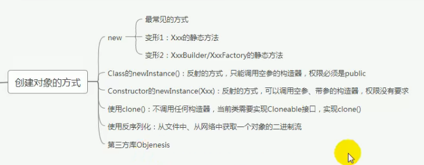
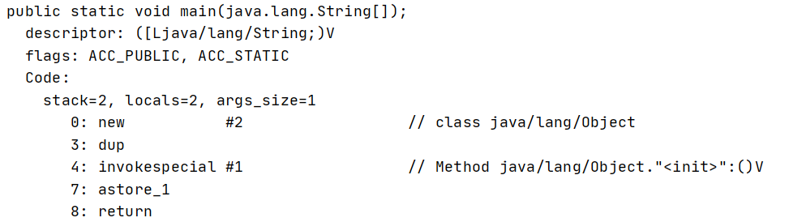
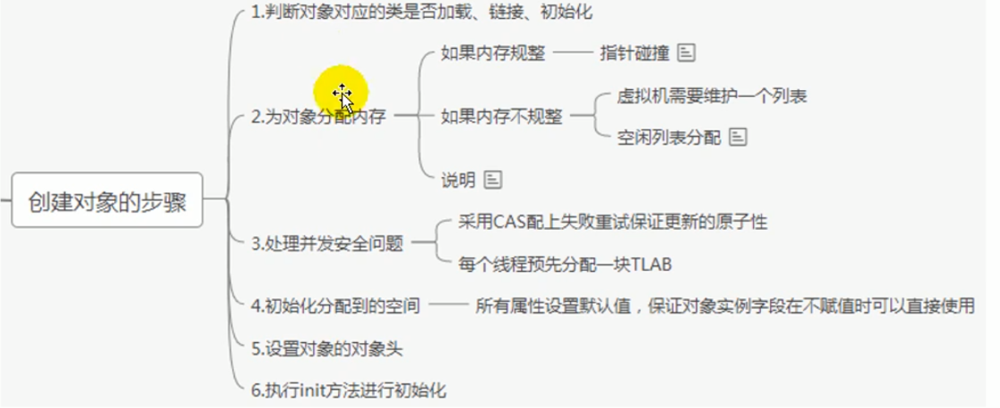
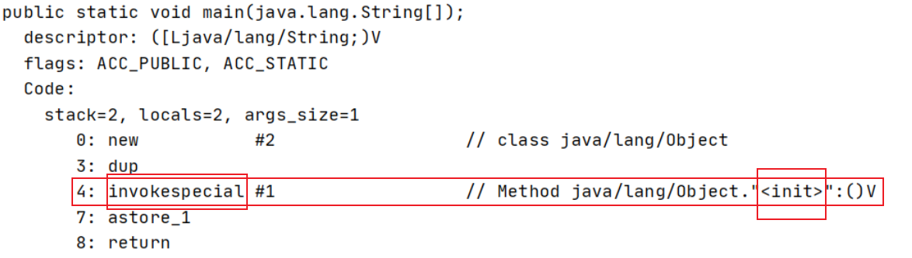
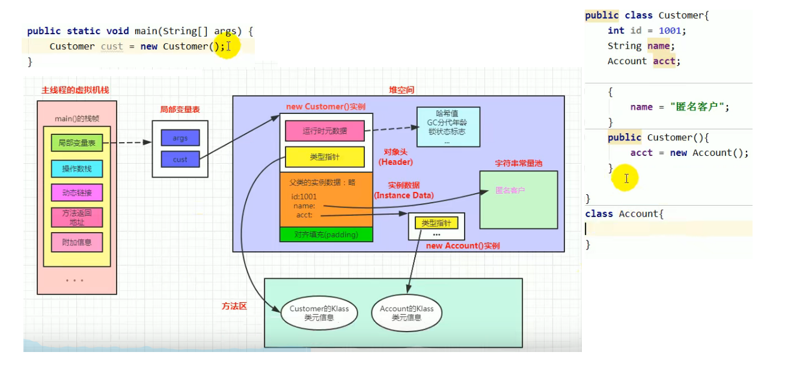
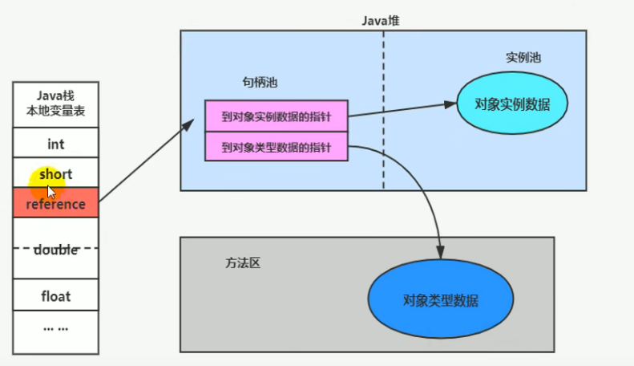
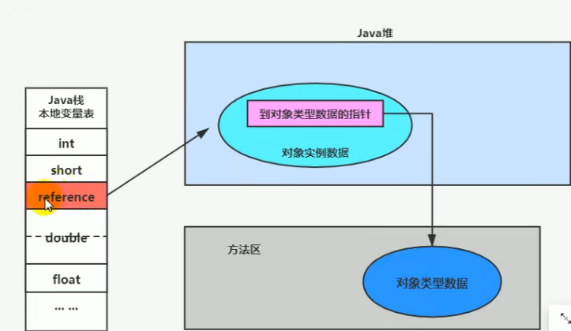
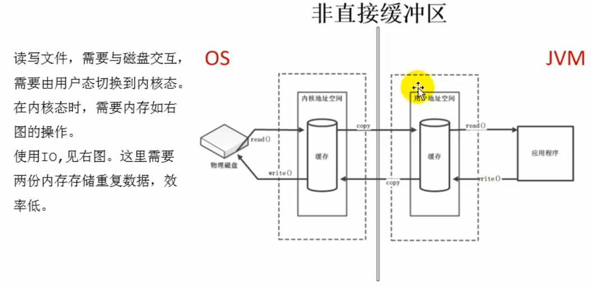
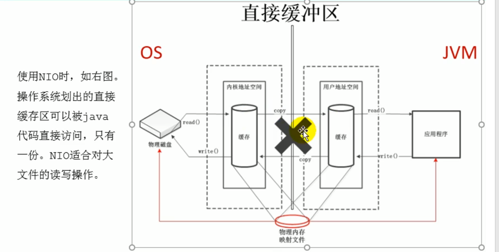

# 8.实例化过程和内存布局

## 1.创建对象的几种方式

- 1.new 最常见的方式，单例类的静态方法Xxx.getInstance()，XxxBuilder和XxxFactory等也是调用new来创建实例的。

- 2.Class的newInstance()：反射的方式，只能调用空参的构造器，且权限必须是public。所以在JDK9被标注为过时的。

- 3.Constructor的newInstance(Xxx)：反射的方式，可以调用空参，带参的构造器，权限没有要求。

- 4.使用clone()：不调用任何构造器，当前类需要实现Cloneable接口，实现clone()方法，会得到一个新的对象，但这是一种浅克隆（如果对象中有对象属性，那么这个对象属性还是原来的，但是我们可以在重写的clone方法中对其进行处理，将对象属性也进行克隆得到新的对象属性，但是这也只是多克隆了**一层**，并不是深克隆），深克隆可以靠序列化实现。

- 5.使用反序列化：序列化可以实现数据从一个进程到另一个进程的传递。从文件，网络中获取一个对象的二进制流，然后将二进制流还原成内存中的一个对象。

- 6.第三方库Objenesis：利用字节码技术，动态的生成Constructor对象

  

## 2. 创建对象的步骤：字节码

我们先从字节码指令来看看大致的过程

```java
public class ObjTest {
    public static void main(String[] args) {
        Object obj = new Object();
    }
}
```

`javap -v -p ObjTest.class `



- 字节码指令1 new	#2：

  先从运行时常量池找#2的位置，找到了 java/lang/Object 这个class，也就是先从方法区中确定Object这个类有没有被JVM加载，如果没加载那么回到java/lang包下加载Object这个类。

  new这个字节码还会到堆中为对象开辟好内存，且大小也能确定下来，int/short/boolean/char/byte/float/reference都是4字节，double/long是8字节。而且还要为属性进行一个**临时**初始化 ，赋予默认值。

  并且将指向该对象的引用压入操作数栈。

- 字节码指令2 dup：

  dup就是一个复制操作，复制一个指向该对象的引用压入栈，此时栈中有两个指向堆中该对象的引用。一个引用主要进行赋值操作，一个作为句柄用来调用相关的方法。

- 字节码指令3 invokespecial #1    // Method java/lang/Object."<init>":()V：                 

  调用运行时常量池中#1位置处的方法，也就是构造方法，主要是为了对实例进行一个显式（**主要是代码块和构造器的初始化**）的赋值操作。注意此处是空参构造方法，其实在new Object()这句代码中并没有进行什么赋值或初始化的相关操作。但是如果调用的是new Student("txl", 12)这样的有参构造，那么这里就会对实例中的属性进行一次显式赋值操作。

  补充：对象实例化过程中的属性初始化。

  - 属性的默认初始化：int name;

  - 显示初始化/代码块中初始化：int name = "txl";  {name = "txl"}

    静态代码块：是在JVM启动时就执行了且只执行一次，而此时还没有对象，所以不能为对象属性赋值，但是可以为类属性赋值。

    类中的代码块：每次创建对象的时候都会执行一次，且先于构造方法执行（**构造代码块即类中的非静态代码块时依托于构造函数的，构造函数执行时它才会执行**）。

    静态代码块 ---> 类中的非静态代码块 ---> 构造方法。

  - 构造器中初始化

- 字节码指令4 astore_1：

  最后将操作数栈中的变量（指向对象的引用），放到局部变量表中。


## 3.创建对象的步骤：执行步骤

前面所述的是从字节码角度看待对象的创建过程，现在从执行步骤的角度来分析：



1. 判断对象对应的类是否已经加载，链接，初始化。

   虚拟机遇到一条new指令，首先去检查这个指令的参数是否能在Metaspace的常量池中定位到一个类的符号引用，并且检查这个符号引用代表的类是否已经被加载，解析和初始化（即判断类元信息是否存在）。如果没有，那么在双亲委派模式下，使用当前类加载器以ClassLoader+包名+类名为Key进行查找对应的.class文件进行类的加载。如果没有找到文件，则抛出ClassNotFoundException异常，如果找到，则进行类加载，类元信息放到方法区中，并生成对应的Class对象放在堆中

2. 为对象分配内存。

   首先计算对象占用空间大小，接着在堆中划分一块内存给新对象。如果实例的成员变量是引用变量，进分配引用变量空间4字节即可。

   然后要判断堆内存是否规整，规整意味着容易从中找到一块连续的内存区域来存放对象。如果内存是规整的，那么虚拟机将采用指针碰撞法（Bump The Pointer）来为对象分配内存。意思是所有用过的内存在一边，空闲的内存在另一边，中间放着一个指针作为分界点的指示器，分配内存就仅仅把指针向空闲那边挪动一段与对象大小相等的距离即可。如果垃圾收集器选择的是Serial（串行）, ParNew（并行）这种基于**标记压缩/整理算法**的，它会解决内存的碎片问题，所以内存会比较规整，虚拟机是采用这种分配方式。即一般使用带有Compact（整理/压缩）过程的收集器，使用指针碰撞。

   如果堆内存是不规整的，即已使用的内存和未使用的内存相互交错（会有大量的内存碎片），那么虚拟机将采用的是空闲列表法来为对象分配内存。意思是虚拟机维护了一个列表，记录哪些内存块是可用的，再分配的时候从列表中找到一块足够大的空间划分给对象实例，并更新列表上的内容。这种方式称为“空闲列表Free List”。对应着使用**标记清除算法**的垃圾收集器，比如CMS。

   总而言之，选择哪种分配方式由Java堆是否规整来决定，而Java堆是否规整又由所采用的垃圾收集器师傅带有压缩整理功能决定的。

3. 处理并发安全问题。

   我们知道创建对象时是从堆中分配空间的，但是堆空间的绝大部分是线程共享的，那么在创建对象的时候就很可能出现线程安全问题，比如对同一块内存区域进行操作。具体采用了两种策略：

   - 采用CAS失败重试，区域加锁：保证指针更新操作的原子性
   - 在Eden区为每个线程预先分配一块线程私有的TLAB（本地线程分配缓冲区）：默认是开启的，可以通过-XX:+UseTLAB参数来设定：把内存分配的动作按照线程划分在每个线程各自的空间之中进行，即每个线程在Java堆中预先分配一小块其私有的内存。

4. 初始化分配到的空间。

   对对象的属性进行默认初始化，能保证对象实例中的属性在不赋值时可以直接使用。

5. 设置对象的对象头。

   将对象的的所属类（即类的元数据信息），对象的HashCode和对象的GC信息，锁信息等数据存储在对象的对象头中，这个过程的具体设置方式取决于JVM实现。

   

   在HotSpot虚拟机的对象头包括2部分内容，第一部分用于存储对象自身的运行时数据，如哈希码（HashCode），GC分代年龄（Eden区-->S0--S1--->老年代），锁状态标志，线程持有锁，偏向线程id，偏向时间戳等。这部分数据的长度在32位和64位的虚拟机中分别是32bit，64bit，官方称为**Mark Word**。

   对象头的另一部分是类型指针class pointer/Klass word，即对象指向它的类元数据的指针，虚拟机通过这个指针确定对象是哪个类的实例。如果对象是一个数组，在对象头中还必须包含一块用于存放数组长度的数据，因为虚拟机可以用过不同对象的元数据信息确定Java对象的大小，但是数组的元数据中没有数组大小信息（数组对象的长度和类型是不固定的）。

6. 执行init方法进行初始化。

   主要是**代码块和构造方法中**的初始化操作，init方法就对应着类的构造器的调用（其中构造代码块即类中的非静态代码块时依托于构造函数的，构造函数执行时它才会执行），进行显式初始化。在Java程序的视角看来，初始化才真正开始：初始化成员变量，执行实例化代码块，调用类的构造方法，并把堆内对象的首地址赋值给引用变量。

   因此一般来说（由字节码中是否跟随有invokespecial指令所决定），new指令之后会接着解释执行方法，把对象按照程序员的意愿进行初始化，这样一个真正的对象才算创建出来。

   

   **即最后一步是调用构造器，为对象进行初始化操作完成后，才算对象创建完成。**


## 4.Java对象的内存布局


1. 对象头Header：

   - 运行时元数据（Mark Word）：哈希值HashCode（引用根据哈希值找到对象在堆中的首地址），GC分代年龄，锁状态标志，线程持有的锁，偏向线程ID，偏向时间戳。

   - 类型指针：指向**类元数据InstanceKlass**，确定该对象所属的类型（并不是所有的对象都有类型指针）。

     （Class对象和普通对象一样，也是存放在堆中；尽管加载进来的类信息是放在方法区当中的，这点要注意！）

   - 如果是数组，还需要记录数组的长度

2. 实例数据Instance Data

   说明：这部分是真正存储对象的有效信息，包括程序代码中定义的各种类型的字段（包括从父类继承下来的和本身拥有的）。

   规则：相同宽度的字段总是被分配在一起，父类中定义的变量会出现在子类之前，如果CompactFields参数为true（默认值false）则子类的窄变量可能插入到父类变量的空隙。

3. 对其填充Padding

   没有特殊含义，是为了保证对象的大小必须是8字节的整数的而预留的占位符，如果对象大小就是8字节的整数倍，该部分可以不存在，否则就需要对其填充来补全。

4. 图示：

   


## 5.对象的访问定位

JVM是如何通过栈帧中的对象引用（局部变量）访问到其内部的对象实例的呢？目前主流的访问方式分为句柄和直接指针两种。

1. 如果使用句柄访问的话，那么Java堆中将会划分出一块内存来作为句柄池，reference中存储的就是对象的句柄地址，每个句柄包含了两部分信息，即对象实例数据指针与类型数据指针（方法区中的元数据）的具体地址信息。

   

2. 直接指针，reference中存储的直接就是对象地址，堆中的每个对象的实例数据又会存储一个指向其类型数据（元数据）相关的信息相关的指针。显然根据我们上面学习的Java对象的内存布局来说，HotSpot虚拟机就是采用的这种方式。

   
   
3. 优劣
   
   这两种对象的访问方式各有优劣，使用句柄来访问的最大好处就是reference中存储的是稳定的句柄地址，在对象被移动（垃圾收集时移动对象是非常普遍的行为）时会改变句柄中的实例数据指针，而reference本身不需要修改。但是要专门开辟句柄池耗费内存多，且从reference到对象中见还要经过句柄。
   
   使用直接指针访问的最大好处就是速度快，节省了一次指针定位的时间开销。HotSpot虚拟机使用的时直接指针定位对象的方式，但是句柄方式定位对象在其他系统中也是十分普遍的。相对于句柄来说缺点就是在对象被移动时后，而reference也需要修改。
   

## 6.直接内存

直接内存不是虚拟机运行时数据区的一部分，也不是《Java虚拟机规范》中定义的内存区域。直接内存是在Java堆外的，直接向系统申请的内存区域。其来源于NIO，通过存在堆中的DirectByteBuffer操作Native内存。通常访问直接内存的速度会优于Java堆，即读写性能高。

- 处于性能考虑，读写频繁的场合可能会考虑使用直接内存。
- Java的NIO库允许Java程序使用直接内存，用于数据缓冲区。





我们说在JDK8之后，HotSpot方法区的落地实现是元空间，元空间直接使用本地内存来分配空间的。逻辑上虽然说方法区是属于Java堆的，但具体实现上两者是分开的，方法区和堆分别看作两块区域，尤其是JDK8之后，方法区更是直接使用本地内存。因为方法去的大小不会直接受限于-Xmx指定的最大堆大小的影响，但是系统内存毕竟是有限的，Java堆和直接内存的总和依然受限于操作系统能给出的最大内存。

如果一直在申请本地内存，超出了操作系统能给的程度，也会报OOM：`OutOfMemoryError: Direct buffer memory`。极有可能是NIO造成的，一直在申请本地内存。

缺点：

- 分配回收成本较高
- 不受JVM内存回收管理

直接内存大小可以通过MaxDirectMemorySize设置，如果不指定，默认与堆的最大值-Xmx参数值一致。

简单理解：Java进程运行时内存空间 = java堆空间 + 本地内存空间


   

