# 9.执行引擎

## 1.执行引擎概述

- 执行引擎是Java虚拟机核心的组成部分之一。“虚拟机”是一个相对于“物理机”的概念，这两种机器都有代码执行能力，其区别是物理机的执行引擎是直接建立在处理器，缓存，指令集和操作系统层面的，而虚拟机的执行引擎则是由软件自行实现的，因此可以不受物理条件制约地定制指令集与执行引擎的结构体系，能够执行那些不被硬件直接支持的指令集格式。

- JVM的主要任务是负责装载字节码到其内部，但字节码并不能够直接运行在操作系统上，因为字节码指令并非等价于本地机器指令，它内部包含的仅仅只是一些能够被JVM所识别的字节码指令，符号表，以及其他辅助信息等。那么如果想要让一个Java程序运行起来，执行引擎的任务就是将字节码指令解释/编译为对应平台上的本地机器指令才可以。简单来说，JVM中的执行引擎充当了将高级语言翻译为机器语言的译者。

- 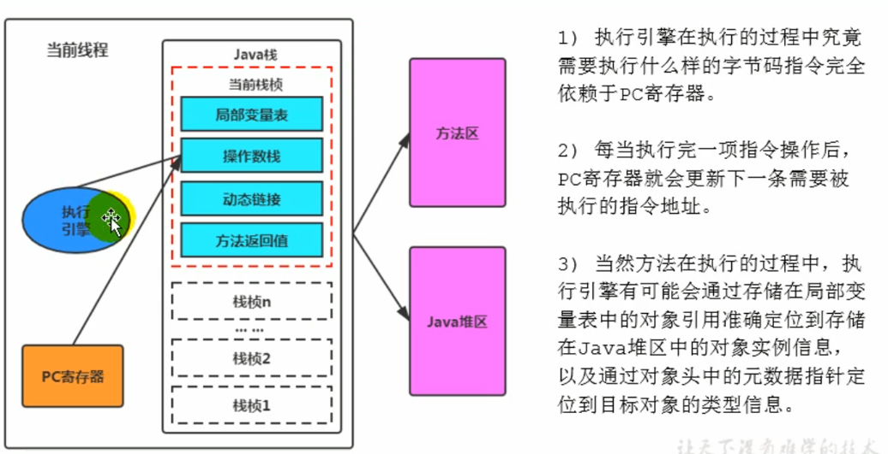

  所有的Java虚拟机的执行引擎输入的是字节码的二进制流，处理过程是字节码解析执行的等效过程，输出的是执行结果。


## 2.Java代码编译和执行的过程

大部分的程序代码转换成物理机的目标代码或虚拟机能执行的指令集之前，都需要经过上图中的各个步骤。

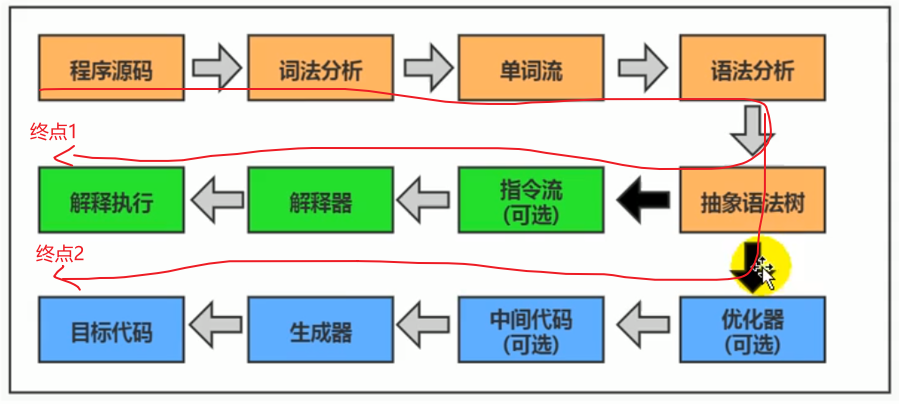

1. javac前端编译过程：

   其中从程序源码-->抽象语法树，得到抽象语法树后还会遍历语法树最后得到一个线性的字节码指令流即.class文件，最后得到.class文件。黄色过程是由javac前端编译器进行前端编译完成的，大致过程如下图：

   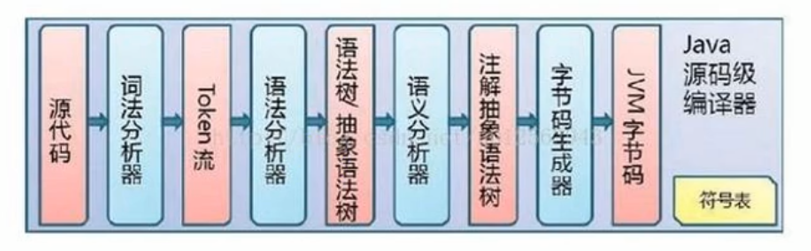

2. 什么是解释器，什么是JIT编译器？

   - 解释器：当Java虚拟机启动时会根据预定义的规范对字节码采用逐行解释的方式执行，逐行解释PC寄存器指向的字节码指令，将其“翻译”为对应平台的本地机器指令，然后再执行。**逐行解释**
   - JIT（Just In Time Compiler）编译器：就是虚拟机将源代码直接编译成和本地机器平台相关的机器语言。**一次编译**

3. Java是半编译半解释型语言。

   JDK1.0时代，将Java语言定位为“解释执行”还是比较准确的，此时还没有JIT编译器。再后来Java也发展出了可以直接生成本地代码的编译器，现在JVM的执行引擎既包含解释器也包含编译器。
   
   JVM在执行Java代码的时候通常都会将解释执行与编译执行二者结合起来进行，其中JIT即时编译器能把字节码指令（尤其是热点代码对应的字节码指令）翻译成本地机器指令，然后作为缓存放在方法区中，称为JIT代码缓存。那么对于热点代码的频繁调用执行，就可以直接到JIT缓存进行执行，Java程序的执行效率会很高。同时JIT将热点代码翻译成本地机器指令的过程中，还可以不断进行不断的优化，深度的优化，使得Java程序的执行效率越来越高。
   
   
## 3.机器码，指令，汇编语言

1. 机器码：计算机能直接执行的二进制序列

   - 各种用二进制编码方式表示的指令，叫做机器指令码。一开始人们就用它编写程序，这就是机器语言。
   - 机器语言虽然能够被计算机理解和接受，但和人们的语言差别太大，不容易被人们理解和记忆，并且用它变成容易出差错。
   - 用它编写的程序一经输入计算机，CPU可以直接读取运行，因此执行速度最快。
   - 机器指令和CPU紧密相关，所以不同种类的CPU所对应的机器指令也不同。

2. 指令

   - 由于机器码是由0和1组成的二进制序列，可读性实在太差，于是人们发明了指令。指令就是把机器码中特定的0和1序列，简化成对应的指令，一般为英文简写，如mov，inc等，可读性稍好。
   - 由于不同的硬件平台，执行同一个操作，对应的机器码可能不同，所以不同的硬件平台的同一种指令比如mov，对应的机器码也可能不同。

3. 指令集

   - 不同的硬件平台有各自支持的一套指令，且互相之间存在差别。因此每个平台所支持的指令，称之为对应平台的指令集。
   - 如常见的x86指令集，对应的是x86架构的平台；ARM指令集，对应的是ARM架构的平台。

4. 汇编语言

   - 由于指令的可读性还是太差，于是人们又发明了汇编语言。在汇编语言中，用助记符（Mnemonics）代替机器指令的操作码，用地址符号（Symbol）或标号（Label）代替指令或操作数的地址。
   - 在不同的硬件平台，汇编语言对应着不同的机器语言指令集，通过汇编过程转成成机器指令。由于计算机只认识指令码，所以还需要将汇编语言编写的程序翻译成机器指令码后，计算机才能识别和执行。

5. 高级语言

   任何高级语言要先经过编译过程编译成成汇编语言（只不过一般会略过该说法，直接说将字节码解释/编译成机器指令，但是中间还是会经过汇编这一步的），再经过汇编过程翻译成机器指令，然后才能被CPU执行。

   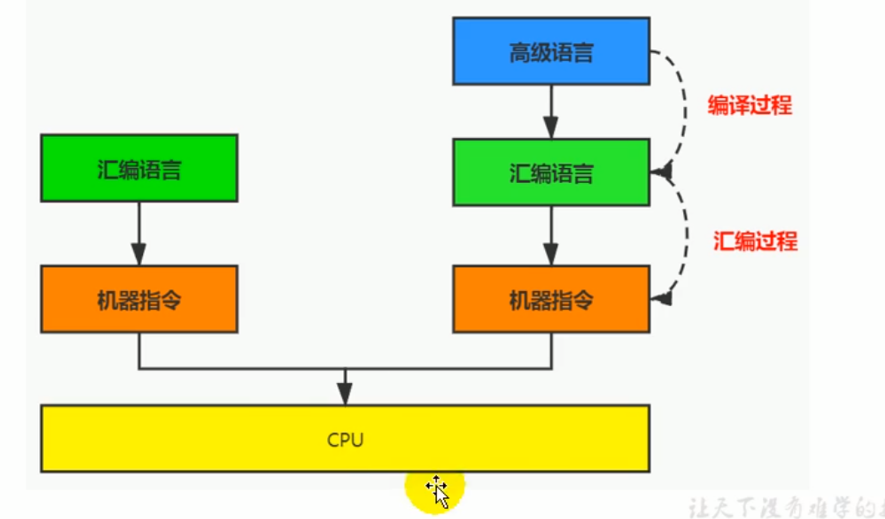

   比如C/C++代码源程序的执行过程：

   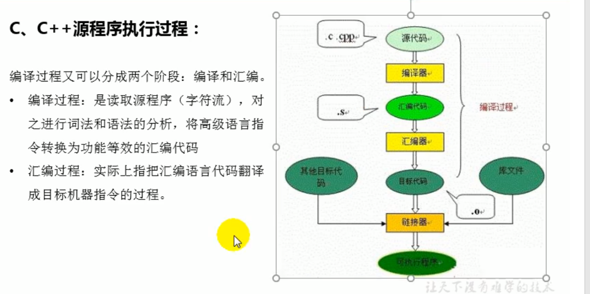
   
## 4.解释器

JVM的设计者们为了实现Java程序的跨平台性，因此避免采用静态编译的方式直接生成本地机器指令（同一份Java代码在不同平台对应的机器指令是不同的，那么将这个过程延后，向前为所有平台抽出一层字节码和虚拟机，实现每个平台都能运行Java代码），从而诞生了通过解释器逐行解释字节码得到本地机器指令，进而执行程序的想法。

1. 解释器的工作机制

   - 解释器真正意义上所承担的角色就是一个运行时“翻译者”，将字节码文件中的内容“翻译”为对应平台的本地机器指令执行。
   - 当一条字节码指令被解释执行完成后，接着再根据PC寄存器中记录的下一条需要被执行的字节码指令，对其进行解释操作。

2. 解释器的分类

   在Java的发展历史里，一共有两套解释执行器，即古老的字节码解释器和现在普遍使用的模板解释器。

3. 现状：引入JIT即时编译技术

   基于解释器执行已经沦落为低效的代名词，为了解决这个问题JVM平台支持一种叫做即时编译的技术。即时编译的目的是避免函数完全被解释执行，可以将热点代码整体编译为机器码，每次执行时直接执行编译后的机器码即可，这种方式可以使执行效率大幅度提示。


## 5.JIT编译器

1. HotSpot VM是目前市面上高性能虚拟机的代表之一，它采用**解释器与即时编译器并存**的架构。在Java虚拟机运行时，解释器和即时编译器能够相互协作，各自取长补短，尽力去选择最合适的方式来权衡编译本地代码的时间和直接解释执行代码的时间。在今天，Java程序的运行性能早已脱胎换骨，已经达到了可以和C/C++程序一较高下的地步。

2. 为什么还需要解释器？

   既然HotSpot VM中已经内置了JIT编译器，那么为什么还需要再使用解释器来“拖累”程序的执行性能呢？比如JRockit VM内部就不包括解释器，字节码全部都依靠即时编译器编译后执行。

   主要是因为解释器又一大好处：当程序启动时，解释器可以立马发挥作用，程序很快得到响应，即解释器能让程序很快进入执行状态，响应速度快。而编译器要把代码都变成本地机器指令后，程序才开始运行，即需要一定的编译时间。

   所以尽管JRockit VM程序的执行性能会非常高效，但程序在启动时必然需要花费更长的时间来进行编译。对于服务端应用来说，启动时间并非关注重点，程序在服务端启动后主要关注其运行性能，所以编译器更适合这种场景。但对于那些看重启动时间的应用场景而言（比如客户端程序），就需要采用解释器与编译器并存的架构来换取一个平衡点了。

   在此模式下，当Java虚拟机启动时，解释器可以首先发挥作用，让程序很快启动，而不必等待即时编译器全部编译完后再执行。随着时间的推移，编译器开始发挥作用，把越来越多的代码编译成本地代码，获得更高的执行效率。

   同时，解释执行在编译期进行优化不成立的时候，还可以作为编译器的后备方案，为其兜底。

3. 案例：解释执行与编译执行在线程环境微妙的辩证关系

   机器在热机状态可以承受的负载要大于冷机状态，如果以热机状态时的流量进行切流（将流量切给冷机），可能使处于冷机状态的服务器因无法承载流量而假死。

   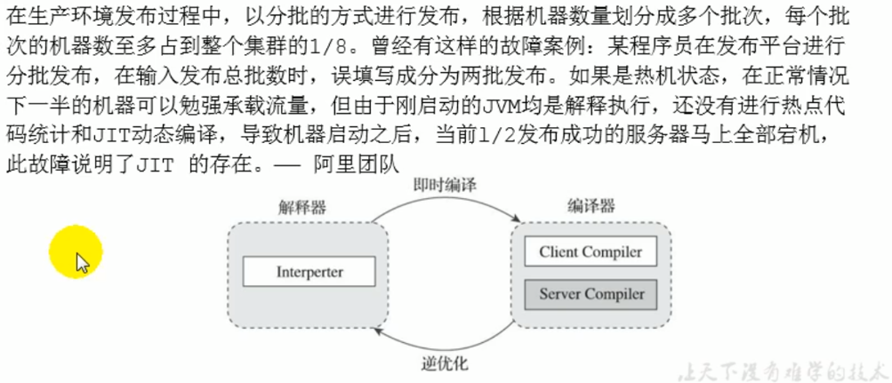

4. Java的几个编译器概念
   
   - Java语言的“编译器”其实是一段“不确定”的操作过程，因为它可能是指一个前端编译器或者说编译器的前端，主要是把.java文件转变成.class文件的过程。
   - 也可能是指虚拟机的后端运行期编译器，即JIT编译器，把字节码转换成机器码的过程
   - 还可能是指使用静态提前编译器，AOT编译器 Ahead Of Time Compiler，直接把.java文件编译成本地机器代码的过程。
   
5. 热点代码及探测方式

   - 并不是说会对Java程序的所有代码都直接编译成本地机器指令，而是根据代码被调用执行的频率来决定哪些代码会被编译。这些需要被编译成本地机器指令的字节码，也称为**热点代码**，JIT编译器在运行时会针对那些频繁被调用的“热点代码”做出深度优化，将其直接编译为对应平台的机器指令，以此提升Java程序的执行性能。

   - 热点代码：一个被多次调用的方法，或者是一个方法体内部循环次数较多的循环体都可以被称为**热点代码**，会被JIT编译器编译为本地机器指令。由于这种编译方式发生在方法的执行过程中，因此也被称之为栈上替换，或简称为**OSR（On Stack Replacement）编译**。

   - 调用多少次才算热点代码：一个方法究竟要被调用多少次，或者一个循环体究竟需要执行多少次循环才可以达到热点代码标准？这里主要依靠热点探测功能。HotSpot VM的热点探测方式是基于计数器的热点探测，它为每一个方法都建立了2个不同类型的计数器，分别为方法调用计数器（Invocation Counter）和回边计数器（Back Edge Counter）。

     - 方法调用计数器用于统计方法的调用次数。
     - 回边计数器用于统计循环体执行的循环次数：在字节码中遇到控制流向后跳转的指令称为“回边”。

     阈值在Client模式下是1500次，在Server模式下是10000次，超过这个阈值就会触发JIT编译。这个阈值可以通过虚拟机参数-XX:CompileThreshold来人为设定。

   - 大致过程：当一个方法被调用时，会先检查该方法是否存在被JIT编译过的版本，如果存在，则优先使用编译后的本地代码来执行。如果不存在已被编译过的版本，则将此方法的调用计数器值+1，然后判断**方法调用计数器与回边调用计数器值之和**是否超过阈值。如果超过，则会向编译器提交一个该方法的代码的编译请求。

     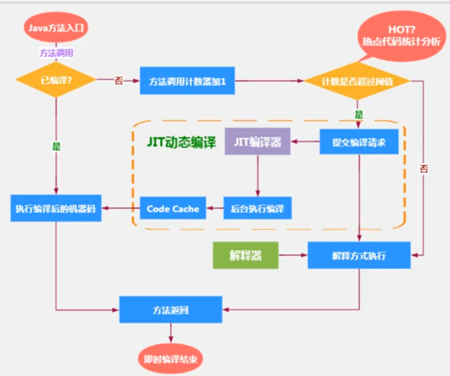
     
     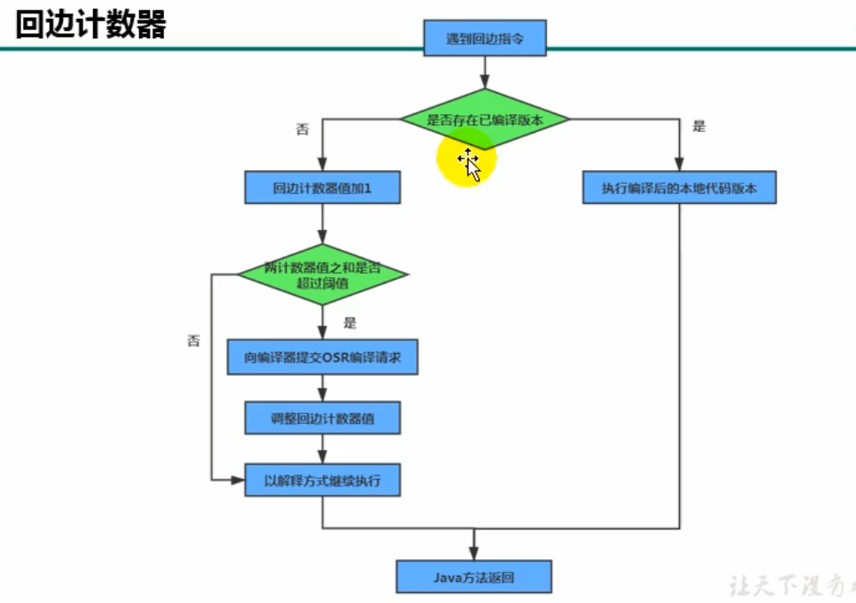

6. 热度衰减

   考虑这样一个问题，我们上面说方法调用计数器有个阈值，当超过该阈值时，该方法的字节码就会被JIT编译成本地机器码缓存在方法区中。那么只要这个项目一直运行着，那么该方法被调用的次数在一段时间后大概率就会达到这个阈值，即时它执行的频度很低。

   所以方法调用计数器统计的并不是方法被调用的绝对次数，而是一个相对的执行频率，即**一段时间之内方法被调用的次数**。当超过一定的时间限度，如果方法的调用次数仍然不足以让它被JIT编译，那么这个方法的调用计数器就会减半，这个过程称为方法调用计数器热度的衰减（Counter Decay），而这段时间就称为此方法统计的半衰周期（Counter Half Life Time）。

   进行热度衰减的动作是在虚拟机进行垃圾收集时顺便进行的。

   可以使用-XX:+/-UseCounterDecay来开启/关闭热度衰减，关闭的话方法计数器的值早晚回达到阈值，这样只要系统运行的时间足够长，绝大部分方法都会被编译成本地代码。另外可以使用-XX:CounterHalfLifeTime参数设置半衰周期的时间，单位是秒。

   
   
7. 设置HotSpot执行程序方式
   
   默认情况下HotSpot采用解释器与即时编译器并存的架构，当然开发人员可以根据具体的应用场景，通过命令显示地为Java虚拟机指定在运行时到底是采用解释器执行，还是完全采用即时编译器执行。
   
   - -Xint：完全采用解释器模式执行程序
   
     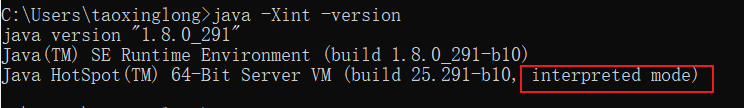
   
   - -Xcomp：完全采用即时编译器模式在执行程序，如果即时编译出现问题，解释器会介入执行。
   
     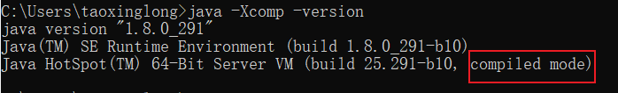
   
   - -Xmixed：采用解释器+即时编译器的混合模式共同执行程序。
   
     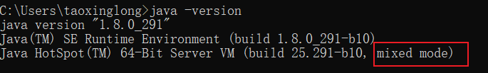
   
     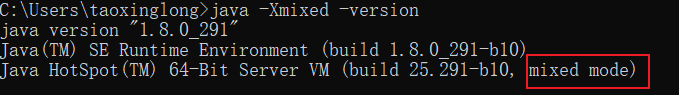
   
   - 代码演示：
   
     ```java
   /**
      * 测试解释器模式和JIT编译模式
      *  -Xint  : 4034ms
      *  -Xcomp : 531ms
      *  -Xmixed : 521ms
      */
     public class JITCompiler {
         public static void main(String[] args) {
     
             long start = System.currentTimeMillis();
     
             /**
              * 循环100W次，1W就达到了回边计数器的阈值，然后JIT会对其进行编译，缓存机器指令。
              */
             testPrimeNumber(1000000);
     
             long end = System.currentTimeMillis();
     
             System.out.println("花费的时间为：" + (end - start));
     
         }
     
         public static void testPrimeNumber(int count){
             for (int i = 0; i < count; i++) {
                 //计算100以内的质数
                 label:for(int j = 2;j <= 100;j++){
                     for(int k = 2;k <= Math.sqrt(j);k++){
                         if(j % k == 0){
                             continue label;
                         }
                     }
                     //System.out.println(j);
                 }
     
             }
         }
     }
     ```
   
8. HotSpot中JIT的分类：
   
   HotSpot VM中内嵌了两个JIT编译器，分别为Client Compiler和Server Compiler，但大多数情况下我们简称为C1编译器和C2编译器。开发人员可以通过如下命令显示指定Java虚拟机在运行时到底使用哪一种即时编译器。
   
   - -client：指定Java虚拟机运行在Client模式下，并使用C1编译器。C1编译器对字节码进行编译时耗时较少，但是优化程度较浅。
   - -server：指定Java虚拟机运行在Server模式下，并使用C2编译器。C2编译器对字节码编译优化耗时较长，但优化程度较深，优化后的代码执行效率也更高。
   - 注意：64的操作系统仅支持Server模式。
   
9. C1和C2编译器不同的优化策略

   - C1编译器的优化策略主要有方法内联，去虚拟化，冗余消除。
     - 方法内联：将引用的函数代码编译到引用点出，这样可以减少栈帧的生成，减少参数传递以及跳转过程。
     - 去虚拟化：对唯一的实现类进行内联
     - 冗余消除：在运行期间把一些不会执行的代码折叠掉。
   - C2编译器的优化主要在全局层面，**逃逸分析**是优化的基础。基于逃逸分析，C2编译器有如下几种优化。
     - 标量替换：用标量值替换聚合对象的属性值
     - 栈上分配：对于未逃逸的对象，分配对象在栈而不是堆
     - 同步消除：清除不需要的同步操作，通常是synchronized。
   - 分层编译（Tiered Compilation）策略：程序解释执行（不开启性能监控）可以出发C1编译，将字节码编译成机器码，进行简单优化，也可以加上性能监控，C2编译器会根据性能监控信息进行激进优化。不过在JDK7版本以后，一旦开发人员在程序中显示指定命令“-server”时，默认将开启分层编译策略，由C1编译器和C2编译器相互协作共同执行编译任务。
   - 总的来说：
     - 一般来讲，JIT编译出来的机器码性能比解释器高。
     - C2编译器编译代码耗时比C1编译器慢，系统稳定以后，C2编译器编译后的代码执行速度远远快于C1编译器。

     

## 6.Graal和AOT编译器

1. 自JDK10起，HotSpot又加入了一个全新的即时编译器：Graal编译器，且编译效果在短短几年时间就追平了C2编译器。目前带有“实验状态”标签，需要使用开关参数：-XX:+UnlockExperimentalVMOptions -XX:+UseJVMCICompiler激活使用。

2. AOT编译：所谓AOT Ahead Of Time Compiler静态提前编译，是与即时编译相对的一个概念。我们知道即时编译指的是在程序运行过程中，将字节码转换为可在硬件上直接运行的机器码，并部署至托管环境中的过程。而AOT编译指的是在程序运行之前，便将字节码转换为机器码的过程，得到**.os二进制文件**。

   JDK9引入了实验性的AOT编译器jaotc，它借助了Graal编译器，将输入的Java类文件转换为机器码，并存放在生成的动态共享库中。

3. AOT的优劣

   - 好处：Java虚拟机直接直接执行已经预编译过的二进制机器码，不必等待即时编译器的预热（方法调用计数器/回边计数器达到阈值），减少Java应用给人带来“第一次运行慢”的不良体验。
   - 缺点：
     - 破坏了java“一次编译，到处运行”的特点，必须为每个不同硬件OS编译对应的发行包。
     - 降低了Java链接过程的动态性，加载的代码在编译器就必须全部已知。
     - 尚未成熟，最初只支持Linux x64系统。


